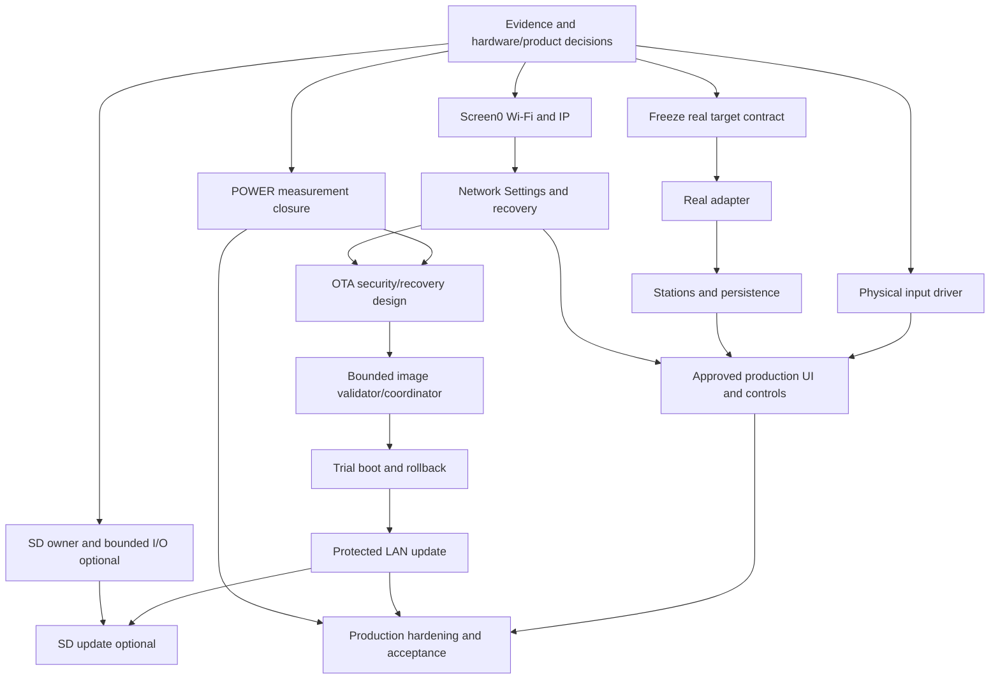

# REMOTE//01 completion roadmap - current canonical reconciliation

2026-10-05 - Today's Step2. Product authority: [canonical owner decision register](REMOTE01_PRODUCT_DECISIONS.md), items1-38. This current roadmap replaces the stale decision gates below; the entire earlier roadmap is retained in the explicitly historical archive at the end. Milestone IDs are planning labels, not new accepted stages.

## Current automatic SYSTEM_SLEEP implementation ? 2026-10-05

DECIDED: external PRESENT/ABSENT/UNKNOWN does not gate automatic sleep; normal30s display idle/300s total system idle. NETWORK owner now quiesces services/Wi-Fi with bounded POWER prepare/readiness/cancel coordination before Core/LVGL park, and restores saved-STA operation/diagnostics after local wake. Normal sleep uses physical GPIO wake, no recurring2s timer; development Z retains the old health fallback. [Implementation, verification and owner procedure](SYSTEM_SLEEP_NETWORK_IMPLEMENTATION.md). OWNER HARDWARE VALIDATION PASS for motion wake and, on2026-10-06, SYSTEM_SLEEP -> touch wake -> first touch consumed -> second touch normal -> NETWORK/diagnostics recovery; other unreported validation checks remain PENDING. No automatic hard-off; separately implemented GPIO1 divider sensing is telemetry/UI only, hardware acquisition validation PENDING. Historical Stage1 OPEN; prior Today's Step1/Step2 and covered Stage2B.2 closure unchanged; Network Settings physical validation remains blocked by missing UI/harness, not FAIL.

## Earlier canonical sleep policy audit STOP ? historical, superseded - 2026-10-05

**DECIDED: automatic SYSTEM_SLEEP independent of external-power PRESENT/ABSENT/UNKNOWN.** Supersedes the former unknown-source sleep prohibition. This is not automatic hard-off authorization; SYS_EN remains asserted and existing battery thresholds/wake behavior unchanged. Planned external5V divider unchanged and separate; no charging detection inferred.

Current source still enforces external ABSENT and therefore real UNKNOWN inhibits sleep. No source change made: audit found mandatory STOP conditions. POWER parks Core/LVGL only; no NETWORK acknowledgement, HTTP/DNS drain/stop or Wi-Fi stop/restart. Existing2s RTC wake timer remains armed each manual sleep round. IDF5.5.3 requires Wi-Fi stopped for this explicit light-sleep path; connection-preserving automatic light-sleep would be a different PM design, not enabled by current configuration.

Next scope: smallest owner-coordinated NETWORK stop/resume lifecycle, transient-event/generation/deadline handling, service recovery and safe provisioning/pending-work refusal, plus justified normal-sleep timer strategy. Do not silently implement a larger redesign or simply remove the source-state predicate. Normal30s display-idle/300s system-idle timing stays the baseline. Focused eligibility/unsafe-work/wake/no-hard-off tests plus normal/soak/clean build are required only after a separately reviewed safe implementation. Current artifact/resources unchanged; no current sleep-enabled owner test artifact. [Full audit/evidence](STAGE_1_BATTERY_POWER_MANAGEMENT.md#2026-10-05---automatic-system-sleep-policy-revision-audit-stop).

## Current product boundary

REMOTE and TUNER are physically separate. TUNER owns internet-radio streaming/decoding/playback/output. REMOTE is designed primarily for TUNER, retaining protocol-neutral model/adapter boundaries for intended Home Assistant/openHAB compatibility; those integrations are optional hubs neither required nor central. Matter/Smart-TV/IR remain historical/intended directions below TUNER Native priority. Zigbee EXCLUDED. Dormant REMOTE codec/audio BSP is inventory only, excluded until cleanup; no active local-radio audio branch.

TUNER discovery uses mDNS, with manual IP/hostname fallback allowed. Actual wire protocol UNKNOWN / NOT RECOVERED; Native API candidate unapproved/unfrozen. WebSocket + HTTPS is not selected: transport DESIGN REQUIRED after real source/capability verification.

## Owner acceptance ledger

| Area | Current status and boundary |
| --- | --- |
| Today's Step1 / overnight running regression | CLOSED / OWNER HARDWARE VALIDATION PASS: HOME/IP, carousel0->1->2->1->0, controls/touch, idle/touch/motion wake and browser diagnostics. Exact W/B evidence retained in overnight execution report. |
| Stage2B.2 POWER/WoM investigation | CLOSED for measured/covered correction paths; latest minimum1256 B above provisional1024 B review target, not a safety guarantee. Current WoM PASS; S/B interference disproven. Prior IMU_WOM0 incident real/currently not reproduced/root cause unknown. |
| Historical Stage1 | OPEN for its mandatory evidence ledger; today's Step1 is distinct and does not waive it. |
| Stage2A / Stage2B | Previously accepted baseline preserved; deferred Stage2A recovery gates remain. Diagnostics/serialR owner PASS; no OTA transfer acceptance inferred. |
| Partition migration | Owner accepted16MiB factory + otadata + ota_0 + ota_1; preserve layout/NVS. |
| Network Settings backend | HARDWARE VALIDATION BLOCKED BY DESIGN / MISSING USER-ACCESSIBLE UI OR HARNESS, not FAIL. OPEN_SETUP/CANCEL/confirmed Wi-Fi reset not physically owner-tested. |
| New owner product requirements | Documentation decisions only; SD backup/artwork/input/sensing/OTA implementation and hardware acceptance not claimed. |

## Decisions versus remaining work

| Product area | Settled decision | Remaining classification / work |
| --- | --- | --- |
| Playback/control | TUNER primary; external audio ownership | Real target source/protocol UNKNOWN / NOT RECOVERED; transport DESIGN REQUIRED; adapter implementation/tests/hardware interoperability pending. Absence of REMOTE MP3/AAC/streaming is expected. |
| Integrations | Home Assistant/openHAB intended and optional; Matter/Smart-TV/IR subordinate historical/intended directions; Zigbee EXCLUDED | Concrete mapping/deployment/compatibility evidence pending; no support badge inferred. |
| Discovery | mDNS plus optional manual IP/hostname fallback | Service details, authoritative identity and real interoperability not approved by naming mDNS. |
| Network Settings | User-accessible IP/status/setup/reprovisioning required | Final flows DESIGN REQUIRED; UI/harness and backend physical validation required. Preserve captive security and credentials. |
| Resets | Wi-Fi-only versus general/factory separation DECIDED | Erase/survival/retention of settings, last TUNER, artwork cache and local service state DESIGN REQUIRED. No factory erase implementation here. |
| UI | Development/Mock temporary; approved production replacement required | Navigation/focus/settings/reset/media flows DESIGN REQUIRED; qualified fonts/geometry/accepted hardware preserved. |
| Controls | Encoder + three physical buttons DECIDED | GPIO/A-B/push if used/pins/levels/pulls/detents/pulses/CW-CCW IMPLEMENTATION + HARDWARE VALIDATION REQUIRED; contextual actions/press/wake mapping DESIGN REQUIRED. No claim actions were never approved. |
| Wake | Motion emits no control intent; first wake touch consumed; no PWR recovery dependency | Preserve accepted contract; new physical-control wake mapping separately designed/tested. |
| External power | Owner-installed100k/100k PTH5V/PTHG divider, GPIO1 ADC1 ch0; automatic SYSTEM_SLEEP remains external-independent | Owner source/node0.00V/0.00V disconnected, approximately4.95V/2.42V connected. Calibrated acquisition, diagnostics and screen2 USB-presence icon IMPLEMENTED; firmware readings, provisional600/1800mV debounce and icon OWNER HARDWARE VALIDATION PENDING. Charging UNKNOWN. [Evidence/retest](GPIO1_EXTERNAL_POWER_SENSING.md). |
| Battery |1000mAh Li-Po/protection PCB; no SOC/cutoff inferred from capacity | Existing independent voltage/endurance/simulation evidence gaps remain; charging UNKNOWN. |
| SD | Firmware backup before flashing/updating DECIDED | Routing/detect/power/mount/unmount/bounded I/O/removal/error IMPLEMENTATION + HARDWARE VALIDATION REQUIRED. No SD-purpose decision gate. Backup content/verification/retention and failure behavior DESIGN REQUIRED within update/recovery design. |
| Persistence | Favorites/recent stations TUNER; Wi-Fi/UI settings/last TUNER/artwork cache REMOTE | Local storage/reset/service policies DESIGN REQUIRED. REMOTE does not persist station database/favorites; no REMOTE capacity/lifetime milestone. Mandatory CCM command-history durability is separate. |
| Artwork | REMOTE lookup/retrieval/cache/thumbnail for active stream URL; stale context discarded | Sources/formats/dimensions/bytes/timeout/redirect/error/decode/cache quota/eviction/lifetime/fallback DESIGN REQUIRED; bounded implementation/hardware acceptance pending. |
| OTA | Required; same-local-network access without password authentication; pre-flash/update SD backup required | Writer/transfer not implemented. Image identity/compatibility/downgrade/interruption/trial/health/rollback/factory-slots-SD relationship DESIGN REQUIRED. No prior authentication-required gate retained as current access policy. |

## Active dependency order and milestones

Branches may proceed with separately approved scope; implementation absence never reopens a settled product decision. Frozen CCM remains authoritative for model semantics. No milestones authorize firmware edits or uploads in this documentation task.

| ID | Current objective / prerequisite | Validation boundary |
| --- | --- | --- |
| M0 | Close remaining historical Stage1/2A acceptance evidence and verify actual resources/target source. Product decisions come from register, not external/local role selection. | Retain exact artifact identity, voltage/endurance/wake-isolation evidence; no invented pins or target contract. |
| M1 | POWER publication/headroom correction gate CLOSED for covered paths. | Production workload/error/development-feature review still separate; no stack increase or WoM workaround justified. |
| M2 | Preserve implemented and owner-tested HOME/IP presentation and accepted navigation. | Do not infer additional Screen0 readability tests beyond reported owner evidence. |
| M3 | Design/freeze user Network Settings/wizard/reset UI; exercise local backend through approved UI/harness. | Router change/cancel/replacement/confirmed Wi-Fi-only reset, credential preservation; no full erase. |
| M4 | Design OTA image trust/compatibility/downgrade/interruption/trial/rollback and SD backup/recovery contract. Access already decided: same LAN, no password. | Define image checks and recovery; access policy does not approve a signature/trust-root mechanism. No eFuse or partition change. |
| M8 | Required SD firmware-backup service: verify physical interface; bounded mount/I/O/removal/errors; backup identity/completeness/readback/recovery contract from M4. | No formatting or media operation now; safe absent/full/corrupt/removed-card behavior must be designed/tested before updates. |
| M5 | After M4, bounded inactive-slot validator/coordinator; implement required backup via M8 before any flashing/update path. | Backups and write exclusion/order/failure handling proved before physical update; preserve NVS/factory and bounded memory. Design/host work can run before media acceptance. |
| M6 | Trial boot/health/rollback/recovery after validated coordinator and owner-approved bootloader scope. | Physical interruption/recovery tests only after verified SD backup path and approved safe procedure; no PWR dependency. |
| M7 | Same-LAN OTA transfer without password, after M4/M5/M6/M8 and accepted backup behavior. | LAN access boundaries/resource/client limits, backup-before-write, update rejection/interruption/recovery under UI/POWER/network load; provisioning security unchanged. |
| M9 | Historical SD-staging/SD-OTA proposals only; not an active required milestone. | Canonical SD use is backup, not update-source selection. New source scope would require separate approval. |
| M10 | Implement/verify electrical inputs and bounded capture; explicit action/focus/press/wake design/freeze. | No invented GPIOs/push/direction; preserve touch/motion and serialized intents. |
| M11 | Verify actual TUNER source/protocol; select transport, review/freeze API separately, implement native adapter. mDNS selected. | CCM conformance/capability/session/fencing and real interoperability tests; no local-radio engine. Target repository work separately authorized. |
| M12 | Present/select TUNER station/favorites/recent data; playback executed and persistence owned by TUNER. REMOTE local settings/association/cache storage separately bounded. | Catalog identity/lateness/reconnect/policy and target-side persistence verified with real evidence; no REMOTE station/favorites database. |
| M13 | Approved production UI plus REMOTE-owned context-safe artwork pipeline. | Resource-bounded retrieval/decode/cache, obsolete URL/media result rejection, physical readability/focus/input/error-state acceptance. |
| M14 | Production hardening/freeze/release: accepted selected requirements, recovery/reset policies, development instrumentation exposure review, resource/endurance evidence. | OTA is required, not conditional on whether shipped. Historical Stage1/2A evidence remains a release gate. |

No active REMOTE local-stream/decoder/I2S/audio-output workstream remains. Required update SD backup is a real dependency, not optional downloaded-image staging. It is not implemented by this document; exact backup artifact selection and failure/recovery behavior are design work, not invented here.

## Frozen/protected documents and provenance

CCM1.0.0 unchanged; no direct contradiction found. Model favorites domains/context safety do not establish product persistence/cache/reset policy. OTA LAN access is separate from Core/TUNER authorization. Historical architecture prose describing compatibility-first positioning is superseded at product-priority level only; neutral layer/model contracts remain intact. Native API candidate remains unapproved/unfrozen, even though discovery method is selected.

Evidence precedence: explicit owner decision -> canonical register -> proposal -> implementation evidence. This checkout has no Git metadata. Historical audits below reflect their original evidence availability, not current owner decisions. Original test/build/resource numbers remain dated evidence, not new artifacts.

---

## Historical roadmap archive - superseded current-status and product-decision gates

The following complete pre-Step2 roadmap is preserved verbatim. Its local/external playback gates, local-audio branch, SD-purpose uncertainty/optionality, generic-first positioning, persistence ownership uncertainty and mandatory password/authentication OTA gate are SUPERSEDED by the register/current roadmap above. Earlier pending status is historical; current acceptance ledger is above. No original audit is rewritten to pretend the owner decisions were known then.

# REMOTE//01 evidence-based completion roadmap

Initial audit date: 2026-10-04. The initial audit was documentation-only. The subsequent owner-authorized overnight session is recorded below and in [the execution report](REMOTE01_OVERNIGHT_EXECUTION_REPORT.md). Historical acceptance is preserved; no hardware upload or new physical PASS. Remaining milestones require their documented evidence/decisions.

## Today's Step1 closure - 2026-10-05

**2026-10-05 - Overnight work / Today's Step 1: OWNER HARDWARE VALIDATION PASS. CLOSED / PASS.** Scope: verify the overnight Codex work on real hardware/software. This is not the historical Stage1 acceptance ledger. The earlier "Overall Stage1 / Step1" wording below refers to historical Stage1 only; it must not be read as today's Step1 status.

HOME/IP, carousel0->1->2->1->0, touch/controls, display idle, touch wake, lift wake and browser diagnostics owner PASS. NETWORK CONNECTED/stored1/provisioning0/IP192.168.1.83, errors/allocation_errors0, stack minimum1692 B. POWER IMU1/motions220/bus_errors0/errors0/wakes20/sleep_requests0/rounds0, minimum1256 B, wake-ready240ms; battery REAL/calibrated/valid/NORMAL. G/Y, K/!, Z not used. Exact evidence: [overnight owner closure](REMOTE01_OVERNIGHT_EXECUTION_REPORT.md#2026-10-05---overnight-work--todays-step-1-owner-closure).

| Classification | Final owner decision |
| --- | --- |
| Today's Step1 / overnight verification |**CLOSED / OWNER HARDWARE VALIDATION PASS** for reported checks|
| Broader historical Stage1 |**OPEN**; existing mandatory evidence gaps remain|
| Network Settings backend |**HARDWARE VALIDATION BLOCKED BY DESIGN / MISSING USER-ACCESSIBLE UI OR HARNESS**; not FAIL; OPEN_SETUP/CANCEL/confirmed Wi-Fi reset not physically owner-tested|
| POWER correction |**OWNER HARDWARE VALIDATION PASS for measured/covered paths**;1256 B latest minimum above provisional1024 B target, not a safety guarantee|
| S/B -> WoM interference |**DISPROVEN on current hardware/firmware**|
| Current WoM/lift wake |**PASS in the current owner test**|
| Prior IMU_WOM0 incident |**REAL HISTORICAL OBSERVATION / CURRENTLY NOT REPRODUCED / ROOT CAUSE UNKNOWN**|

Do not classify http_stack_min_bytes0 or DIAGNOSTICS stack_min_bytes0 as defects from the single W snapshot; browser diagnostics owner PASS. No WoM functional fix, automatic sleep validation or backend recovery acceptance inferred. Older status tables are historical unless superseded by this dated decision. No implementation/build/upload.

## Current owner closure - Stage2B.2 / WoM - 2026-10-05

**Stage2B.2 CLOSED for the authorized measured/covered scope.** Latest owner evidence supersedes the historical pending entries below for this milestone only. Exact boot log and sequence: [Stage2B.2 closure report](STAGE_2B_2_POWER_STACK_PATH_MEASUREMENT.md#2026-10-05---owner-hardware-closure-stage-2b2--current-wom-test).

| Item | Current owner-evidenced status |
| --- | --- |
| POWER publication-frame correction | **OWNER HARDWARE VALIDATION PASS for measured/covered paths**; baseline approximately2840 B, STARTUP1416 B, REPORT1304 B, B/COMMAND1256 B latest run. Earlier1248 B remains historical. Provisional>=1024 B target is not a safety guarantee. |
| S/B -> WoM interference | **DISPROVEN on current hardware/firmware**; no R during the S/S/Bx10 interference test. |
| Current WoM/lift-to-wake | **PASS in current owner test**; upload ok1/IMU_WOM1/sleep_ready1, lift PASS3/3 before/after diagnostic activity, IMU1/bus_errors0. |
| Prior IMU_WOM0 incident | **REAL HISTORICAL OBSERVATION / CURRENTLY NOT REPRODUCED / ROOT CAUSE UNKNOWN**; no functional fix applied. |
| Overall Stage1 / Step1 closure | **OPEN** for remaining mandatory acceptance evidence in the Stage1 ledger: artifact identity, physical voltage comparison, explicit normal regression/lifecycle confirmation, idle/wake count and gesture isolation, untouched no-auto-sleep intervals per source, safe battery-condition simulation and recorded battery-only endurance. |

M1 POWER measurement/correction gate is closed for these covered paths; no stack increase or WoM workaround required. Production freeze still requires its broader workload/error-path/development-feature review. Stage1/Stage2A deferred gates and other roadmap milestones are not closed by this report. No automatic deep-sleep validation/enablement. Existing implementation, publication correction and instrumentation unchanged; documentation only, no build/upload.

## Overnight #2 checkpoint - 2026-10-05

**AUDIT COMPLETE / NEUTRAL CONTROLS HOST TESTED / CLEAN BUILD VERIFIED; NO NEW HARDWARE PASS.** Previous IP presentation/recovery/preflight work and all accepted behavior remain unchanged. See [session report](REMOTE01_OVERNIGHT_2_REPORT.md), [hardware map](REMOTE01_HARDWARE_RESOURCE_MAP.md), [controls plan](REMOTE01_PHYSICAL_CONTROLS_PLAN.md), [SD audit](REMOTE01_SD_AUDIT.md), [audio audit](REMOTE01_AUDIO_RADIO_AUDIT.md), [radio decision gate and UI inventory](REMOTE01_RADIO_ARCHITECTURE_DECISION.md).

Hardware-neutral sampled-input model and19 new tests are preparation only: no firmware include, task, ISR, GPIO, UI mapping or Core change. Encoder plus three buttons are verified requirements; push, wiring, physical direction, detents, timing and actions are not. Fixed8-event queue, explicit loss/resync and caller-selected debounce are host tested. Dormant factory buttons are not the product controls. SD remains dormant; product purpose is OWNER DECISION REQUIRED. Audio examples remain excluded; local playback is not implemented. REAL TUNER SOURCE NOT AVAILABLE IN CURRENT WORKSPACE; native API candidate remains unapproved.

| Adversarial completion item | Current status / exact remaining gate |
| --- | --- |
| Screen0 IP; HOME IP | Previous software checkpoint implemented/tested; owner physical readability pending. |
| Network Settings; wizard/recovery | Local backend partial; final approved user flow and physical recovery acceptance pending. |
| Wi-Fi credential reset | Confirmed Wi-Fi-only backend exists; user wizard pending. |
| Factory/general reset | Separate deliberate confirmation required; erase/recovery contract OWNER DECISION REQUIRED; refused by backend. |
| Battery voltage validation | Independent physical multimeter comparison pending; REAL telemetry is not an accuracy PASS. |
| Battery endurance | Specified Stage1 sustained battery tests and owner-approved longer run pending;1000mAh does not justify SOC/runtime or cutoffs. |
| LOW; CRITICAL; recovery/hysteresis | Existing policy/host tests retained; controlled simulation/hardware acceptance and truthful UI feedback pending; no deep-discharge test inferred. |
| Charging/external power | UNKNOWN; automatic SYSTEM_SLEEP remains INHIBITED, display-idle/wake preserved. |
| Stage2B.2 POWER measurement | CLOSED; owner hardware PASS for measured/covered correction paths. Latest minimum1256 B; provisional>=1024 B target is not a safety guarantee. See current closure above. |
| Encoder; three buttons; GPIO validation | Host model ready; actual signals/levels/pulls/routing/wake capture and action mapping require owner input/decisions. |
| SD interface; purpose | Excluded SDMMC/FATFS references audited; routing/detect/power/card validation pending; purpose unknown. |
| Audio hardware; local playback | Dormant profile only; assembled codec/amplifier/output proof and owner architecture decision required. |
| Real TUNER architecture/source/protocol | External control architecture documented; actual target source and approved native/security contract absent. |
| OTA trust; writer; rollback; transfer | Owner trust/version/recovery decisions pending; offline integrity checker only. No writer/activation/transfer added. |
| Production UI | Qualified rendering preserved; final screen flows/actions/network/battery/error/service states require owner design. No redesign. |
| Final hardware acceptance; release readiness | Selected implementations, unresolved Stage1/2A gates, POWER headroom and full integrated resource/endurance evidence pending. |

Additional current gaps found in context: static factory Voltage/RTC/IMU/SD/network/demo fields must not be presented as live product telemetry; obsolete factory instruction text/inaccessible PWR affordances need final-UI review; static Wi-Fi glyph is not connectivity evidence; HOME volume/artwork and Favorites/Devices/Remotes are presentation placeholders/inert rows. Production action semantics remain owner decisions. Startup color demo's LVGL mutation outside the normal UI mutex is a source review concern for later approved demo removal, not a demonstrated race defect and not changed here. Stage2A router-loss/recovery/reprovision and unreported client-platform gates remain in the original roadmap; two Stage2B transient diagnostic errors remain unexplained. Vendor TODOs and historical superseded touch/carousel/serial defects are not reopened as current failures.

No production source/config/driver changes. Normal261 PASS/0 FAIL/429754 assertions; soak261/0/3924004. Clean1.37s/build545.03s exit0, no compiler/CMake warnings/errors. Static DRAM46908 unchanged; linked flash2479981 (-12), BIN2480480 (-16), OTA-slot headroom665248 bytes. Rebuilt artifact/link layout differs; no executable equivalence or metadata-only claim. Exact hashes and protected-source verification are in the session report.

## Overnight implementation checkpoint ? 2026-10-04

**HOST TESTED / CLEAN BUILD VERIFIED; OWNER HARDWARE VALIDATION PENDING.**

- Screen0 **and HOME** now display the copied current STA IP or bounded SETUP/CONNECTING/OFFLINE/NO IP/--. Factory blank row and HOME footer are reused; accepted controls/carousel geometry are unchanged. HOME battery voltage remains POWER-derived; factory Voltage remains a static demo.
- Local-only Network Settings foundation adds setup re-entry/cancel, existing replacement path and generation-fenced10s confirmed Wi-Fi-only reset. No final UI, new HTTP mutation endpoint or serial command. Factory-reset requests are refused; general reset erase-domain/confirmation policy remains OWNER DECISION REQUIRED.
- Offline OTA artifact preflight validates the current unsigned image profile's size/chip/framing/checksum/simple SHA-256. Authenticity and full compatibility are UNCONFIRMED; activation is not authorized. Writer, trial boot, rollback and transfer remain NOT IMPLEMENTED/BLOCKED by security/recovery decisions.
- Settled complete normal242 PASS/0 FAIL/408,133 assertions; soak242/0/3,722,383. Target frames: NETWORK2176 (+96), HOME refresh304 (+160), POWER1248 unchanged. No configured task-stack increase, new task/socket/queue or POWER policy change.
- Final BIN2,480,496 (+2,144), linked flash2,479,993 (+2,144), static DRAM46,908 (+128), OTA-slot headroom665,232 bytes (649.640625KiB). Clean2.23s/build557.88s, exit0, zero compiler/CMake warnings/errors. Partition hash unchanged. Exact BIN/ELF hashes and change inventory are in the execution report.
- Stage1, Stage2A deferred gates and Stage2B.2 physical measurement remain open. No new evidence supports SOC, charging/external detection, physical controls, SD or real TUNER/audio.

Remaining dependency order: collect mandatory physical evidence; approve/implement local Network Settings UI/harness; approve OTA trust/version/recovery policy; coordinator/SDK validation ? trial boot/rollback proof ? authenticated transfer. Hardware controls/SD/real adapter require their own evidence. Production UI and release remain separate. M2 is software-complete only; M3 backend is partial; M4 requires owner decisions; M5 has host artifact preflight only, not a runtime writer. The original audit matrices below describe entry evidence unless this checkpoint explicitly supersedes an implementation status.

## Overnight backlog reconciliation ? entry 2026-10-04

Entry freeze: 1,644 non-build files; BIN/ELF/partition match the recorded Stage 2B.2 hashes below. Git remains unavailable. No new owner acceptance evidence exists. Source was re-inspected before edits.

The earlier roadmap covered the requested product areas but missed the explicit **HOME local-IP** requirement: M2 described only factory Screen0. Actual factory page0 and HOME page2 are distinct. Both must show the authoritative STA address without changing carousel geometry. HOME already reads `power_management::battery_view()` for REAL rounded voltage/SIM/invalid presentation; factory Voltage remains a static generated demo value. Neither is SOC, and factory mock values are not telemetry.

| Outstanding item | Entry classification / exact dependency |
| --- | --- |
| Screen0 **and HOME** STA IP | NOT IMPLEMENTED; software-ready nonblocking copied Status and bounded labels; physical readability pending. |
| Network Settings/setup re-entry/replacement | Backend extension software-ready; final UI OWNER DECISION REQUIRED. Preserve existing candidate-save/security behavior. |
| Wi-Fi-only reset | Existing development G/Y implemented/owner evidence only as recorded; user-facing confirmed backend required. |
| General/factory reset | NOT IMPLEMENTED / OWNER DECISION REQUIRED: erase-domain and confirmation/recovery contract absent; backend must refuse this operation. |
| Battery completion | ADC/calibration/filter/validity/hysteresis implemented and host tested; HOME voltage source verified. Stage1 physical comparison, endurance, safety simulation and acceptance still pending. No justified threshold/filter change found. |
| Battery runtime/endurance | Specified Stage1 battery-only endurance remains pending; a longer overnight runtime measurement is also tracked, with owner-approved duration, physical voltage checks and recovery procedure required. No runtime estimate inferred from1000mAh, no voltage-to-SOC curve or deliberate protection-cutoff/deep-discharge test. |
| POWER stack | Instrumentation HOST TESTED / BUILD VERIFIED; OWNER PHYSICAL MEASUREMENT PENDING.608 bytes is not failure. |
| OTA security | OWNER DECISION REQUIRED: initiator trust, image signing/trust root, replay/downgrade policy and recovery acceptance. Read-only LAN checks are not authentication. |
| OTA validator/writer/boot trial/rollback/transfer | NOT IMPLEMENTED; structural preflight can be developed independently against installed SDK. Writable exposure/activation blocked by security/recovery prerequisites; rollback disabled. |
| Encoder/push/three buttons | OWNER HARDWARE INPUT REQUIRED: pins, levels and semantics absent. No speculative GPIO or action mapping. |
| SD | OWNER DECISION / HARDWARE VALIDATION REQUIRED: dormant pin/profile references do not establish product use or working card interface. |
| Production UI | OWNER DECISION REQUIRED; retain qualified fonts and accepted geometry. |
| Real radio/TUNER | BLOCKED BY VERIFIED SOURCE/PROTOCOL AVAILABILITY: local candidate API is unapproved; no real target implementation established here. No yoRadio assumptions. |
| Final hardware/release | PENDING accepted selected branches plus Stage1/2A evidence and POWER headroom review. |

This session may implement bounded IP presentation, local-only recovery foundation/tests and decision-independent OTA preflight only. No final UI, HTTP mutation route, storage/input hardware activation, image flash writer, boot selection, security policy or POWER change is authorized by guessing missing facts. Other branches continue only when their own evidence permits.

## Evidence and baseline

Evidence precedence is current source/effective build configuration for implementation, and explicit owner reports for physical validation. Host tests and an ELF prove neither wiring nor hardware behavior. Historical plans do not establish implementation. This checkout has **no Git metadata**: `git status` and `git log` fail. Comparison uses pre/post SHA-256 manifests, existing artifacts and dated documentation; no commit history or Git-clean claim is possible.

Inspected root configuration, all local component roles, active build-component list, hardware definitions, startup, LVGL/touch, POWER, NETWORK, diagnostics, HOME/Core/Mock, development dispatch, ten host-test sources and runner, current stage/architecture/CCM review documents, partition CSV and existing ELF sections. Excluded components were inspected as dormant references rather than active functionality. Vendored library presence is not integration evidence.

Primary references:

- [Core implementation](UNIVERSAL_CONTROL_CORE_V1_IMPLEMENTATION.md), [HOME integration](HOME_CORE_INTEGRATION_V1.md), [Phase C](PHASE_C_RUNTIME_HARDENING.md), [Phase D](PHASE_D_GENERIC_ADAPTER_BOUNDARY.md).
- [Stage 1 acceptance/evidence](STAGE_1_BATTERY_POWER_MANAGEMENT.md), [Stage 2A](STAGE_2A_WIFI_PROVISIONING.md), [Stage 2B diagnostics](STAGE_2B_DIAGNOSTICS_REBOOT_PLAN.md), [partition migration](STAGE_2B_OTA_PARTITION_MIGRATION.md), [OTA planning](STAGE_2B_LOCAL_OTA.md).
- [POWER investigation](STAGE_2B_1_POWER_STACK_INVESTIGATION.md), [current path instrumentation](STAGE_2B_2_POWER_STACK_PATH_MEASUREMENT.md), [architecture proposal](CONTROL_ARCHITECTURE.md), [frozen CCM](COMMON_CONTROL_MODEL_V1.md), [unapproved TUNER API candidate](TUNER_NATIVE_API_V1.md).
- [PlatformIO](../platformio.ini), [partitions](../partitions.csv), [startup/display/touch](../main), [component exclusions](../CMakeLists.txt), [test runner](../tests/control/run_tests.py).

README and HARDWARE contain older static-HOME/disabled-network baseline descriptions. Later stage records and running source supersede those descriptions. Early CCM freeze statements about implementation status are historical; the current Core implements a bounded subset, not complete CCM conformance. Earlier pending/preflight OTA statements are superseded only for the accepted partition migration, not for update functionality.

### Acceptance ledger

| Area | Current evidenced status | Boundary/gap |
| --- | --- | --- |
| LCD, touch, carousel, brightness | Implemented; owner hardware PASS | 180-degree orientation, mapped touch, left advances 0→1→2, right returns, snapping/sentinels and readability remain protected. |
| HOME/Core/Mock, Phase C and generic Phase D boundary | Implemented within documented subset; owner accepted/closed | Mock is development-only. No real device adapter, discovery, production persistence or full CCM certification. |
| Stage 1 corrected runtime | Corrected-firmware stability retest PASS; **overall acceptance OPEN** | Missing mandatory evidence is not a newly demonstrated failure; see remaining gates below. |
| Stage 2A provisioning/STA | Owner accepted baseline for Stage 2B | Router outage/recovery and deliberate reprovisioning criteria J/K/L deferred; mobile/OS coverage limited to reported tests. |
| 16 MiB partition migration | Owner hardware ACCEPTED | Retained factory boot and credentials verified. No full erase. Does not validate OTA or rollback. |
| Stage 2B LAN diagnostics and serial R | Owner hardware PASS | Five-second polling/recovery, software reset reason 3, credentials and RTC history preserved. |
| Stage 2B.1 investigation | Repository/target analysis and recorded host soak completed | Frame regression established; physical worst path unidentified. |
| Stage 2B.2 instrumentation/correction | **CLOSED / OWNER HARDWARE PASS for measured/covered paths** | Current WoM test PASS; S/B interference disproven. Prior initialization incident remains unresolved/non-reproduced; no universal safety guarantee. |

Retain Stage 2B observations: POWER minimum **608 bytes**, another post-reboot **800 bytes**, with no demonstrated stack corruption/watchdog/error. Two initial transient diagnostic errors have unknown cause; zero after reboot does not explain them. Socket receive error during deliberately interrupted reboot is an expected test observation.

Active local components are `control`, `control_home`, `control_profile`, `diagnostics`, `i2c_bsp`, `lcd_bl_pwm_bsp`, `lvgl`, `network_manager`, `power_management`, `ui_bsp` and `user_app`, plus main and SDK/managed display/expander dependencies. CMake excludes `adc_bsp`, `audio_bsp`, `ble_scan_bsp`, `button_bsp`, `codec_board`, `esp_wifi_bsp`, `i2c_equipment`, `sdcard_bsp` and `SensorLib`; POWER uses SensorLib register definitions without enabling its legacy runtime. Managed codec support is not in the current active build list. Factory producer/demo infrastructure is not a production feature.

## Hardware capability matrix

Target is the owner-confirmed Waveshare ESP32-S3-Touch-LCD-3.49(B), **V2 Rev1.1**, not an arbitrary DevKit pinout. PlatformIO's generic board identifier does not override verified hardware or explicit memory configuration.

| Hardware/interface | Defined/configured/driver evidence | Integration and physical evidence |
| --- | --- | --- |
| ESP32-S3 | ESP-IDF 5.5.3; 240 MHz; two cores; Xtensa GCC 14.2.0 | Running owner hardware validated. Peripheral budget must include existing owners. |
| Flash | 16 MiB configured and physically verified by esptool; custom accepted table | Migration accepted; do not repartition or relocate NVS. |
| PSRAM | Octal 80 MHz, boot initialization/memtest, allocator enabled; board documentation describes 8 MiB | Runtime PSRAM allocation and multi-MiB telemetry verified. This audit performs no new capacity test. |
| LCD | AXS15231B, 172×640, QSPI SPI3: CS9, CLK10, data11–14; TE21 defined but unused; reset EXIO5 | Active/owner PASS. Rotation and initialization frozen. |
| Touch | AXS touch, I2C1 SDA17/SCL18, address 0x3B; EXIO0 interrupt reference | Active/owner PASS, accepted transform unchanged. Separate from shared system bus. |
| Shared system I2C | I2C0 SDA47/SCL48; TCA9554, QMI8658, RTC reference | Active bus/POWER usage validated; future clients require serialized access and bounded transactions. |
| Expander | TCA9554 address 0x20; EXIO0 touch, 1 backlight enable, 2/3 IMU interrupts, 4 RTC interrupt, 5 LCD reset, 6 SYS_EN, 7 audio NS_MODE reference | Main/POWER managed driver active. GPIO8 shared expander interrupt uses corrected normal-awake falling edge. No bit may be presumed spare. |
| IMU | QMI8658 address 0x6B; POWER configures wake-on-motion | Motion wake owner PASS. No production inertial/gesture service or proven general gyro feature. |
| RTC | PCF85063 address 0x51 and dormant SensorLib/equipment code | Bus device reference exists; no active product clock/time synchronization service or hardware acceptance. RTC reset history is MCU retained memory, not this external RTC. |
| Backlight | GPIO42 LEDC/PWM plus EXIO1 enable | Brightness and display idle/wake PASS; preserve PWM setting across power gating. |
| Battery | ADC1 channel3/GPIO4, 200k/100k divider, calibrated readings/filter; installed Li-Po **1000 mAh**, protection PCB thresholds undocumented | REAL valid voltage observed. Independent physical voltage accuracy comparison still pending. Capacity is metadata, not a voltage/SOC/charger policy input. |
| External power/charging/SOC | Exact V2 audit found no trustworthy MCU-observable VBUS/charger indication | **UNKNOWN / UNKNOWN / unavailable**. Do not infer from battery voltage or USB serial connectivity. |
| Power hold/PWR | EXIO6 SYS_EN asserted early and unconditionally during USB startup | USB boot→battery handover owner PASS. Enclosure PWR inaccessible: normal use/recovery cannot require it. |
| USB/console | Primary UART0 logging with secondary USB Serial/JTAG; installed IDF USB driver receives commands | Interactive USB serial hardware validated, including R. Do not mix Arduino Serial or presume output routing establishes RX. Reserve native USB and console resources. |
| Encoder and push | No integrated driver or verified product pin mapping found | Physical wiring, pull-ups, electrical levels, debounce and action semantics **UNKNOWN**. No invented pins. |
| Three custom buttons | No integrated driver or verified custom-button pin mapping found | **UNKNOWN** wiring/semantics. Dormant factory button component refers to board BOOT/PWR-related signals, not proof of these three controls. |
| SD | Dormant `sdcard_bsp`: SDMMC 1-bit CMD39/D0=40/CLK41; GPIO38 CD/D3 reference | Driver present but excluded/uninvoked; FATFS `/sdcard` example, no automatic format. Card/socket/pin operation unvalidated; no storage owner. |
| Audio | Excluded `audio_bsp`/`codec_board`; S3_LCD_3_49 profile references ES8311 output, ES7210 input, shared I2C47/48; I2S MCLK7/BCLK15/WS46/DIN6/DOUT45 | Vendor PCM playback/record example only. Codec population, amplifier/output, suitability and final audio location **unverified/unselected**. Not an internet-radio implementation. |

Source references: [main definitions](../main), [POWER hardware](../components/power_management/hardware.cpp), [I2C BSP](../components/i2c_bsp), [SD BSP](../components/sdcard_bsp), [audio BSP](../components/audio_bsp), [codec profiles](../components/codec_board).

### Shared-resource constraints

- Do not re-enable dormant I2C equipment/codec initialization wholesale: independent bus/expander initialization can conflict with live handles, IMU wake settings and SYS_EN/LCD/backlight direction or levels. The legacy codec GPIO13 write is guarded for ESP32, not ESP32-S3; it is not a demonstrated current LCD conflict.
- GPIO38–41 SD and candidate I2S pins are references, not an approved free-pin map. GPIO8, 9–14, 17/18, 42, 47/48 and expander bits already have owners. Flash/PSRAM and USB/console reserve further resources; no exhaustive list of available enclosure pins is established.
- GPIO0 KEY and GPIO16 SYS_OUT schematic references do not establish accessible product controls or permission to reuse them. Verify schematic, assembled wiring and board revision before adding encoder/buttons.
- Dormant SD helpers read a file into a caller buffer without a capacity contract and write using data as a printf format. They require bounded API correction/tests before activation. These are dormant source hazards, not observed running failures.

## Feature-status matrix

| Feature | Implementation/test status | Remaining work |
| --- | --- | --- |
| Screens/navigation | Factory page0, brightness page1, HOME page2; accepted carousel geometry/order/sentinels | Development Screen0 Wi-Fi state/IP and final approved production screens absent. No new visual design established. |
| HOME | Qualified fonts/colors, owner-published playback state; PREVIOUS/TOGGLE/NEXT intent path to serialized Core; live battery presentation | Artwork/device/radio examples remain Mock presentation. Quick rows have no navigation handlers; track is not interactive volume control; footer Wi-Fi symbol is static. |
| Provisioning | Secure local AP/captive HTTP/DNS flow, on-device setup material, candidate credentials saved only after successful connection | User-accessible Network Settings/router-change wizard absent. Deferred physical recovery/reprovisioning tests remain. |
| Wi-Fi reset | Development G arm/Y confirm, ten-second window, `remote_wifi` namespace only | Production UI and deliberate confirmation needed. Full factory reset is absent and must be separately designed/confirmed. |
| Diagnostics | Separate connected-STA read-only `/`, `/api/status`, `/api/events?after=sequence`; fixed sanitized owner snapshots/events | Subnet/Host restrictions are LAN access limits, **not user authentication**. No web reboot, raw live logs or persistent logging. Production exposure policy pending. |
| Reboot | Development uppercase R → existing UC dispatch → NETWORK; deferred/coalesced/refused owner restart | Hardware PASS. Current future-writer guard has no real OTA writer behind it; actual update exclusion must be wired before OTA. |
| OTA | Accepted factory + ota0/ota1 + otadata infrastructure | No application inactive-slot writer, image validation flow, boot-selection/update UI, trial confirmation or rollback integration. SDK app_update presence is not implementation. |
| SD/storage | Excluded legacy FATFS example | Storage owner, mount/removal/error handling, bounded I/O/quota and file/security policy unimplemented. SD staging is optional, not a prerequisite to streaming flash OTA. |
| Encoder/buttons | No integrated product input path | Wiring/electrical proof, bounded debounce/events and approved mapping required. Must reuse intent/owner boundaries. |
| Power | POWER owns calibrated ADC/filter, motion wake, display idle and SYS_EN | Stage 1 acceptance evidence and Stage 2B.2 measured headroom remain open. No charge status or reliable percentage SOC. |
| Sleep/shutdown | Automatic system sleep and automatic critical hard-off inhibited for unknown source | Display idle is normal safe policy. Development forced sleep/release commands are not product acceptance requirements or production behavior. |
| Real device control | Frozen CCM + bounded Core + generic adapter boundary + Mock | Discovery, identity/binding/security, wire transport, real capabilities/state/commands, persistence and actual adapter absent. TUNER API is candidate/unapproved, not a selected contract. |
| Radio/audio | Static radio-like text and dormant PCM codec example | No streaming client, compressed-audio decoder, bounded audio pipeline, station catalog/favorites persistence or real playback/reconnect service. No yoRadio architecture/library assumed. |

### Radio architecture decision required

The documented controller architecture points toward REMOTE controlling a separate native TUNER, but there is no implemented TUNER service/adapter or owner-frozen wire contract. The repository does not establish that REMOTE itself should produce audio. Select the product boundary before selecting codecs, decoder libraries or audio pins.

For **external playback**, the playback target must supply streaming, decode, buffering, output, stations and recovery. REMOTE needs an approved adapter/transport, authentication/identity and capability/session handling, bounded state/artwork ingress, station selection/favorites semantics, persistence ownership, UI and physical-input intents. Work in a separate target repository requires separate authorization.

For **local playback, only if explicitly selected**, additionally design bounded network ingestion, supported formats/decoders, PCM/I2S output, buffering/underrun policy, codec/amplifier setup, task/core priorities, DMA/internal-RAM budget, reconnect/error behavior and storage. Present vendor ES8311/ES7210 references do not select the final hardware. Station metadata/artwork and long-running streams must not block NETWORK, POWER, Core or LVGL. Both alternatives require observed state rather than optimistic Mock semantics and explicit persistence/reset behavior.

## Audited entry resource and ownership review

Current BIN/ELF hashes were read during this audit and match Stage 2B.2. ELF sections verify `.dram0.data=24,460`, `.dram0.bss=22,320`; total static DRAM **46,780 bytes**. Generic `size` totals include mapped/dummy sections and are not usable RAM consumption estimates.

| Resource | Evidence / limit |
| --- | --- |
| Current BIN | **2,478,352 bytes**; SHA-256 `b34ad9a8f319532aa7ad898b54d7cd70c08f944452e0090e0c6504a4da6dbd67` |
| Current ELF | **17,693,016 bytes**; SHA-256 `ee6d6e57ac2aa595674e5281ddfb3897c4b0836e88e80b883da1886e7572fff1` |
| Linked flash / rodata | Recorded linked flash 2,477,849 bytes; actual `.flash.rodata` 1,333,860 bytes. Existing UI/assets materially affect future image budget. |
| OTA slots | Each 3,145,728 bytes; BIN leaves **667,376 bytes (651.73 KiB)**. Use complete distributable image size, not ELF file size. |
| Partition map | NVS 0x9000/0x6000; phy 0xF000/0x1000; factory 0x10000/0x800000; otadata 0x810000/0x2000; ota0 0x820000/0x300000; ota1 0xB20000/0x300000. Unpartitioned tail 0xE20000–0x1000000 is not storage authorization. No filesystem partition. |
| Current delta vs accepted Stage 2B | BIN +1,920; linked flash +1,916; static DRAM +952 bytes from fixed POWER measurement state/alignment. No task-stack increase. |
| Display allocations | 22,016-byte internal DMA buffer; 220,160-byte PSRAM framebuffer. Existing canvas allocation expression adds native-resolution PSRAM storage; do not assume asset/framebuffer costs disappear in final UI. |
| Diagnostics | Fixed 8,056-byte PSRAM arena, 48-byte internal control; 32 events, at most16 per response, 3,072-byte JSON response buffer. No unbounded live-log queue. |
| RTC history | 640 retained bytes; validated/versioned, four-boot capacity. POWER exports copied sanitized records; HTTP never reads RTC internals. |
| Networking | Effective LWIP socket maximum10. Provisioning and STA HTTP are mutually exclusive port80 services; each max2 client sockets plus HTTPD internal resources. AP DNS adds a socket. Future transport/TLS/audio/OTA needs a measured joint budget. |
| Effective security/rollback | Automatic bootloader app rollback and flash encryption disabled; secure-boot capability macros do not prove secure boot enabled. Current read-only HTTP cannot become a privileged update endpoint by assumption. |

Task stack sizes are **bytes** on this IDF version; POWER uses `uxTaskGetStackHighWaterMark(nullptr)` without a words conversion.

| Task/context | Stack / priority / affinity | Ownership |
| --- | --- | --- |
| LVGL | 4,000 /4 /core0 | UI/timers and touch rendering under existing coordination. |
| UC_owner | 24,576 /2 /core1 | Core, Mock, intent dispatch, bounded serial input; startup delayed5s. |
| POWER | 4,096 /2 /core1 | ADC, IMU, power state, gated display, reset-history export, POWER diagnostics and B/S/T. |
| NETWORK | 6,144 /1 /core0 | Wi-Fi/NVS, portal/service lifecycle and deferred reboot; delayed6s startup. |
| HTTPD | 6,144 /1 /SDK default unpinned | Bounded request handling; consumes copied diagnostics or queues provisioning work. |
| Legacy startup color task | 4,096 /2 /unpinned, then deletes | Factory startup mutations. Source shows LVGL access outside the main mutex: an existing integration risk to resolve in approved production-UI work, not a diagnosed hardware failure. |

Core owner processes bounded ingress/intent work; HOME intent channel, generic adapter inbox and NETWORK inbox each have 8 slots. Core allocation remains bounded/owner-scoped with PSRAM discipline. HTTP must not call Core/Mock, POWER hardware, or unsynchronized LVGL directly. Future encoder, network settings, OTA and station controls must preserve serialized handoff and stale-session/capability fencing.

The development serial interface reads USB Serial/JTAG in bounded nonblocking batches on UC_owner. Mock commands `p a u 0 1 v d r - + o c s l n f` and telemetry `m` remain distinct from POWER `B I Z L C H N K !`, guarded measurement `S T`, and NETWORK `W G Y R`. POWER/NETWORK commands enqueue to their owners; lower-case `r` is not uppercase reboot `R`. CR/LF are ignored. `Z` is a forced test path and `K`/`!` can release hold; they must not become normal recovery or unattended acceptance actions.

POWER investigation established task frame **496→1,248 bytes (+752)** associated with Stage 2B publication/bookkeeping, including local `Power`448 and `ResetSummary`256. Counterfactual compilation restored496. This supports a regression finding, **not** attribution of physical608 to a specific call. B/reset formatting is a candidate deep path; ADC_OK is a periodic checkpoint, not stall proof. Stage 2B.2's fixed948-byte static measurement state leaves the frame unchanged. Measurements are historical minima; paired probes identify reductions, not isolated instantaneous peak usage. A provisional measured **≥1,024-byte** margin is a review target, not an ESP-IDF safety guarantee. Do not enlarge stacks or move locals to heap before owner measurement.

Historical heap telemetry belongs to its captured firmware/load. It cannot certify this latest development image or a future TLS/audio/OTA workload. New features need internal free/min/largest, PSRAM free/min/largest, all relevant task watermarks, socket/queue counters and allocation accounting under simultaneous use/error paths. General BSP I2C timeout/allocation helpers and dormant driver initialization need review before reuse; POWER's bounded access paths must remain intact.

### Existing verification boundaries

Recorded Stage 2B.2 normal suite: **229 PASS /0 FAIL /394,390 assertions**; soak: **229 /0 /3,591,640**. Recorded clean build succeeds with zero final compiler/CMake warnings/errors. This audit did **not** rerun them. Runner covers ten host source suites (Core, profile, HOME, hardening, ingress, POWER, network model, portal, diagnostics, stack measurement), with measurement-enabled/disabled variants. These exercise bounded models, ingress/fencing, reset records, policy and serialization; they do not execute real ADC calibration, I2C/ISR timing, HTTP/Wi-Fi SDK lifecycle, FreeRTOS task peaks, SD, audio or physical input wiring.

## Dependency order and proposed milestones

IDs below are planning labels, not new accepted stages. Every implementation requires a scope review against then-current source. For each milestone preserve accepted LCD/touch/carousel/backlight, frozen CCM/Core semantics, owner boundaries, NVS schema/partition and safe power policy unless its explicit approved objective requires an interface extension. Never merge unrelated changes just because a build is available.

Parallel branches are allowed after their own prerequisites; SD is optional and local-audio work is conditional. Remaining Stage 1/2A physical evidence is a release gate even where non-invasive planning/UI work can proceed.

### M0 — evidence closure and hardware/product decisions

- **Prerequisites/objective:** current records; collect Stage 2B.2 measurements and remaining Stage 1/2A results; establish encoder/three-button/SD/audio wiring and external-vs-local playback decision. Confirm tested artifact identity.
- **Likely files/preserved interfaces:** stage evidence docs and this roadmap only; no runtime changes.
- **Before flash/owner validation:** no flash needed for document review. Owner supplies measured voltage, missing endurance/wake/gesture-isolation/policy tests, router recovery/reprovisioning and current artifact identity. Use approved instrumentation procedure; no PWR or forced power release.
- **Rollback/STOP/exclusions:** retained accepted artifacts; STOP on insufficient evidence, mark UNKNOWN. Do not invent hardware, close unreported tests or start an implementation under this milestone.

### M1 — close POWER headroom measurement; corrective work only if justified

- **Prerequisite/objective:** owner Stage 2B.2 S/T captures with repeated B, snapshot/reset-copy, ADC, idle/motion/touch wake and HTTP polling; identify attributable new minima and worst relevant paths. Separate proposed correction if needed.
- **Likely files/preserved interfaces:** measurement/stage docs; a justified later correction would involve `components/power_management/runtime.cpp` and focused tests, subject to approved scope. Preserve stack, RTC format/capacity, B/API and policy during measurement.
- **Tests/owner gate:** existing normal/soak and clean build only for source changes; target frame analysis, enabled/disabled measurement parity. Owner long-run combined workload confirms margin/stability.
- **Rollback/STOP/exclusions:** accepted Stage 2B plus retained measurement artifact; STOP without attributable evidence or on errors. No speculative heap migration/stack increase or networking redesign.

### M2 — Development Screen0 Wi-Fi state and STA IPv4

- **Prerequisite/objective:** stable NETWORK snapshot and UI ownership; display only current truthful state/IP, absent when unavailable.
- **Likely files/preserved interfaces:** `components/user_app`, `network_manager` read-copy/UI seam, focused UI tests; preserve carousel geometry and provisioning card/security material rules.
- **Tests/owner gate:** disconnected/connecting/connected/reconnect formatting, bounds/no wrapping, snapshot races; normal/soak/clean build. Owner checks physical172×640 readability and no navigation regression.
- **Rollback/STOP/exclusions:** accepted UI artifact; STOP if snapshot access requires new ownership/API outside approved scope. No wizard, new screens, OTA or UI redesign.

### M3 — user Network Settings and router-change recovery

- **Prerequisite/objective:** approved UI interaction spec plus M2; current IP/status, user-accessible setup wizard and deliberate Wi-Fi-only reset; close Stage 2A recovery gaps.
- **Likely files/preserved interfaces:** `network_manager/{ui,runtime,model,portal,web,dns}`, `user_app`, HOME navigation seam/tests as approved. Reuse NETWORK owner and current credential save/security/captive flow; keep full factory reset separate.
- **Tests/owner gate:** cancel/confirm, stale submissions, failed/auth/outage recovery, namespace-only reset, power interruption and no secret leakage; regression/soak/clean build. Owner changes router, provisions without USB/PWR, reboots and verifies credentials.
- **Rollback/STOP/exclusions:** known credential-preserving artifact; STOP if inaccessible recovery or NVS format change is required. No full factory erase, OTA, networking protocol redesign or sleep changes.

### M4 — OTA threat model, recovery and product approval

- **Prerequisite/objective:** M1/M3 evidence and accepted partitions; freeze authorized updater access, image authenticity/integrity, compatibility, interruption/rollback and USB-only recovery model before any writer.
- **Likely files/preserved interfaces:** OTA design docs only; likely future separate update coordinator integrated with NETWORK and POWER copies. Preserve diagnostics read-only semantics and partition/NVS layout.
- **Tests/owner gate:** design fixtures for wrong board/version/size/signature/truncated image and recovery state machine; owner approves security and accessible recovery procedure. No hardware flash for design.
- **Rollback/STOP/exclusions:** documentation baseline; STOP on unresolved trust/recovery or slot budget. No unauthenticated privileged endpoint, irreversible security eFuse changes, partition growth or implementation bundled into approval.

### M5 — bounded OTA validator/coordinator foundation

- **Prerequisite/objective:** M4 approved; implement bounded streaming validation, update lifecycle and owner exclusion/reboot refusal using inactive slots only, initially without exposed upload.
- **Likely files/preserved interfaces:** new approved OTA component/tests; NETWORK coordinator hooks, diagnostic status and POWER availability only as explicitly scoped. Never buffer entire firmware in heap; retain NVS and factory image.
- **Tests/owner gate:** malformed/oversize/foreign/truncated/corrupt images, bounded buffers, duplicate requests, cancel/write failure, reboot guard and ownership stress; normal/soak/clean build plus slot fit. Controlled physical flash interruption test waits until M6 recovery support.
- **Rollback/STOP/exclusions:** accepted non-writer image; STOP on invalid-image activation risk or undefined guard. No browser transfer, SD, new partition or UI redesign.

### M6 — trial boot, health confirmation and rollback/recovery

- **Prerequisite/objective:** M5 and owner-approved bootloader configuration change; implement explicit boot selection, pending verification, bounded health confirmation and failed-trial recovery while retaining factory.
- **Likely files/preserved interfaces:** OTA component/startup, narrowly approved sdkconfig rollback option and tests/docs. Preserve NVS/partition geometry and USB cold-start hold; no PWR dependency.
- **Tests/owner gate:** trial success/failure/restart, invalid images, interrupted metadata and rollback state fixtures; clean build all affected boot artifacts. Owner verifies both slots, failed trial, power loss and USB-accessible factory recovery before M7.
- **Rollback/STOP/exclusions:** archived accepted factory/bootloader/partition artifacts and documented selective restore; STOP if recovery cannot be demonstrated. No full erase, secure-boot/eFuse provisioning or transfer service.

### M7 — protected local-LAN OTA transfer

- **Prerequisite/objective:** M4–M6 passed; implement approved bounded upload to the validated coordinator, progress/failure reporting and safe completion. Read-only diagnostics remains separate in semantics.
- **Likely files/preserved interfaces:** OTA transport/service, NETWORK lifecycle/guard, approved update UI/API and tests. Bound clients/sockets/timeouts; keep provisioning disabled in connected mode as currently specified.
- **Tests/owner gate:** authorization, Host/subnet checks where applicable, oversized/slow/disconnected clients, reboot refusal, reconnect and repeated updates under UI/POWER/diagnostic load; regressions/soak/clean build/resource budget. Owner proves successful update, interrupted update, rejection and fallback on battery/USB.
- **Rollback/STOP/exclusions:** verified factory/previous slot; STOP on privileged exposure, heap/stack/socket exhaustion or unavailable recovery. No SD updater, credentials/security-format change or automatic sleep.

### M8 — optional SD storage owner and bounded I/O

- **Prerequisite/objective:** M0 physical pin/card proof and storage-use decision; safe mount/unmount, capacity-bounded reads/writes and explicit filesystem/removal policy.
- **Likely files/preserved interfaces:** `sdcard_bsp` replacement/adaptation, new storage owner, approved CMake inclusion and host tests. Preserve buses/pins/power ownership; existing FATFS example is a candidate, not a final storage contract.
- **Tests/owner gate:** bounds, format strings, missing/full/corrupt card, removal, concurrency/timeouts and interrupted writes; regression/soak/clean build. Owner validates card compatibility, removal and responsiveness.
- **Rollback/STOP/exclusions:** SD-disabled artifact; STOP on pin conflict/unbounded I/O or uncertain data-loss policy. No auto-format, audio, SD OTA or credentials on card.

### M9 — optional SD OTA source

- **Prerequisite/objective:** M5–M8 plus approval that SD update is useful; feed the same authenticated/compatible image validation and coordinator from bounded file reads.
- **Likely files/preserved interfaces:** OTA source adapter/storage owner/tests; preserve exact activation/rollback/security rules and no direct UI filesystem access.
- **Tests/owner gate:** wrong file, partial read, card removal and update interruption; regression/soak/clean build. Owner validates success/rejection/recovery with card removal.
- **Rollback/STOP/exclusions:** verified previous slot/factory; STOP if SD weakens authenticity or creates a second updater. No new image format, filesystem redesign or downloaded-file staging by default.

### M10 — encoder/push/three-button input foundation

- **Prerequisite/objective:** owner wiring/electrical proof and approved neutral event contract; bounded debounce/encoder accumulation and queues.
- **Likely files/preserved interfaces:** new input owner/driver/tests, approved pin definitions and main startup; preserve touch wake isolation, bus/GPIO ownership and serialized facade intents. ISR only records bounded events.
- **Tests/owner gate:** bounce, direction, simultaneous/held buttons, overflow, sleep-idle wake and stale-event refusal; regression/soak/clean build. Owner verifies every physical input and coexistence with touch/motion.
- **Rollback/STOP/exclusions:** inputs-disabled artifact; STOP on unknown mapping/levels, lost wake isolation or GPIO conflict. No final action mapping, new Core semantics or UI design.

### M11 — approve real target contract, then implement one adapter

- **Prerequisite/objective:** M0 external/local decision and approved protocol/security contract. Freeze the currently unapproved TUNER API or choose another explicit contract; then separate implementation scope for one real adapter.
- **Likely files/preserved interfaces:** architecture/API docs first; later new adapter/transport and integration tests, Core boundary integration only as approved. Preserve frozen CCM, capability/session fencing, no buffered replay and owner-scoped ingress.
- **Tests/owner gate:** contract fixtures, authentication/identity, stale/duplicate/delayed completions, disconnect/reconnect, unsupported capabilities and bounded payloads; normal/soak/clean build. Owner validates against actual target hardware, not Mock. External target changes need separate repository authorization.
- **Rollback/STOP/exclusions:** Mock/accepted Core artifact; STOP if contract or target implementation is unavailable, or requires frozen semantics changes. No station UI, local decoder or discovery framework bundled into first adapter.

### M12 — stations/favorites/selection persistence and playback recovery

- **Prerequisite/objective:** M11 real adapter PASS and approved target-owned station/playback capabilities; implement bounded catalogs, selection/favorites and truthful observed state with explicit persistence/reset ownership.
- **Likely files/preserved interfaces:** adapter/use-case/storage models, facade and approved persistence component/tests. Preserve Wi-Fi namespace, request fencing and no direct HOME→Mock/device access.
- **Tests/owner gate:** station IDs/limits, persistence versioning, corrupt/interrupted data, reconnect, capability removal and delayed completion; regression/soak/clean build. Owner verifies playback/stations/favorites across reboot/network failure.
- **Rollback/STOP/exclusions:** prior adapter image with documented migration reversal; STOP on unknown station/persistence semantics. No full factory erase, artwork pipeline or audio engine bundled in.

### M13 — approved production UI and physical action mapping

- **Prerequisite/objective:** owner-approved screen specification, M3/M10/M12 as needed; replace development/demo content and map controls using available capabilities and observations.
- **Likely files/preserved interfaces:** `user_app`, `control_home`, UI/navigation/input layers and tests; remove factory startup/task/assets only within approved scope. Preserve panel orientation/touch, qualified fonts, facade and power coordination.
- **Tests/owner gate:**172×640 bounds/wrapping/focus, unavailable states, every action route, stale intents, wake first-touch behavior and bounded artwork if separately approved; regression/soak/clean build. Owner validates all screens/input/navigation on physical panel.
- **Rollback/STOP/exclusions:** accepted development HOME artifact; STOP without approved design or new resource budget. No invented product design, wire protocol changes or local audio.

### Conditional local-audio branch

Only after explicit local-playback approval, propose separate milestones for hardware/codec output proof, bounded decoder/buffer pipeline, then network streaming/station integration. Likely scope: audited `audio_bsp`/`codec_board` or replacement, a separate audio owner, transport/storage/use-case adapters and tests. Preserve shared I2C/expander/SYS_EN and existing task ownership. Before flash require codec/pin proof, format/error fixtures, bounded buffers and integrated soak/build budgets; owner verifies output, underruns, reconnection and coexistence. Roll back to audio-disabled artifact; STOP on unselected hardware or resource/timing conflict. Do not combine output bring-up, decoder selection and internet radio into one milestone or assume yoRadio.

### M14 — production hardening and full acceptance

- **Prerequisite/objective:** selected feature branches accepted; remaining Stage 1/2A evidence closed; measured POWER margin reviewed; establish production configuration and reproducible artifacts.
- **Likely files/preserved interfaces:** approved development-feature gates, release config/docs/test fixtures and narrowly scoped reset/settings implementation if separately specified. Keep Wi-Fi reset distinct from deliberate confirmed full factory reset; inventory exactly what each erases.
- **Tests/owner gate:** production build removes dangerous dev mutation/probes as approved; security/no-secret review, full normal/soak, integrated failure/power-loss tests, clean build/hash/slot/resource report. Owner endurance, controls/network recovery, update/recovery, battery voltage/idle/wake and all approved product functions.
- **Rollback/STOP/exclusions:** archived accepted factory/previous OTA and settings-migration recovery plan; STOP on any unclosed mandatory gate or unsafe reset path. No silent eFuse provisioning, factory erase, new features or automatic sleep enablement.

## Physical gates and unresolved questions

Remaining Stage 1 requirements include independently measured battery voltage, exact tested artifact identity, explicit carousel/snapping/brightness/Phase D regression confirmation,20 idle/wake cycles and first-contact isolation, untouched10min per power source with automatic sleep inhibited, safe LOW/CRITICAL qualification/hysteresis simulation, and30min battery-only endurance. Existing shorter stability and later partition/diagnostic battery tests contribute evidence but do not silently satisfy missing durations/counts. Do not discharge a battery to test undocumented protection thresholds.

Owner must resolve encoder/push/three-button wiring and actions, SD physical interface/card needs, actual audio population/output and playback location, protocol/security contract, approved final UI, station/persistence requirements, and safe OTA authorization/recovery. External/charging observability remains UNKNOWN unless new exact-board evidence establishes a signal. Automatic sleep may remain inhibited permanently; deeper sleep is not a mandatory release feature or a reason to fabricate detection. Any future power-policy change requires a separate hardware-supported proposal.

## Unattended work and release rules

**Suitable after bounded scope approval:** read-only audits; contract/design reviews; host fixtures, model/serializer/image-validation/debounce tests; bounded implementation against frozen interfaces; clean builds/ELF/resource/hash reports; Screen0 formatting/UI bounds; documentation reconciliation. Each must stop on scope gaps, hardware assumptions, failed regression or unapproved security decisions. Never upload or claim physical PASS.

**Requires owner interaction:** wiring verification, voltage measurement, POWER path capture, input/audio/SD bring-up, router-change recovery, physical readability, update interruption/rollback/recovery, battery endurance and release acceptance. Irreversible eFuse/security provisioning, repartitioning or erasing credentials is not unattended work.

Release gates: selected requirements implemented and owner accepted; no open mandatory Stage1/2A gaps; POWER measurement/headroom conclusion supported; bounded joint RAM/PSRAM/flash/socket/stack budgets; no spontaneous reset/WDT or unaccounted resource failure; real adapter semantics validated; accessible recovery without PWR; approved OTA trust/rollback if shipped; production diagnostics/development commands reviewed; explicit independent Wi-Fi and factory-reset policies; versioned artifacts/hashes and reproducible build. Automatic system sleep remains inhibited for UNKNOWN external power. Historical observations and unexplained errors remain recorded without invented root causes.

## Original audit verification

The initial audit authorized only this roadmap and a minimal CHANGELOG entry: no source/config/test/historical stage edits, build, tests or upload. Its pre/post inventory covered1,643 entry files and unchanged BIN/ELF hashes. The separately owner-authorized overnight implementation uses its own1,644-file entry inventory and final verification in [REMOTE01_OVERNIGHT_EXECUTION_REPORT.md](REMOTE01_OVERNIGHT_EXECUTION_REPORT.md). Neither verification establishes new physical acceptance.

## Owner acceptance - 2026-10-05

**PASUL 2 - RECUPERARE + AUDIT + RECONCILIERE DECIZII: CLOSED / PASS.** Explicit owner acceptance of Today's Step2 historical recovery, audit and canonical documentation reconciliation. This closes the documentation milestone only; it does not validate or implement future product features, close historical Stage1, approve the Native API candidate or change hardware acceptance boundaries. Canonical owner decisions and existing evidence remain intact. Documentation only; no implementation/tests/configuration/artifact change, build or upload.
