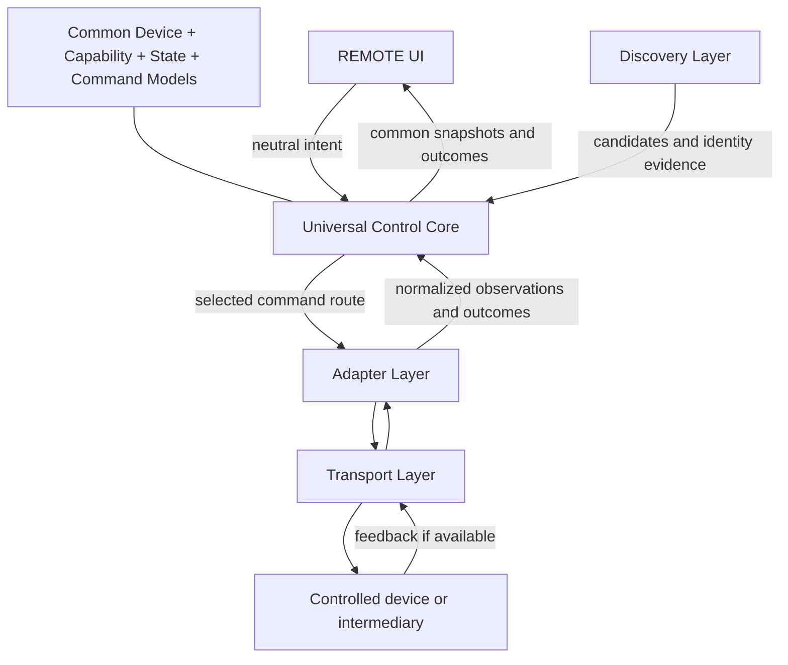

# Current owner product positioning - 2026-10-05

[Canonical decision register](REMOTE01_PRODUCT_DECISIONS.md), items1-12, supersedes earlier product-priority framing. REMOTE is primarily designed for physically separate TUNER; TUNER owns streaming/decoding/playback/audio output. REMOTE is not generic-first or TUNER-independent. Protocol-neutral common-model/layer contracts remain intact for intended optional Home Assistant/openHAB compatibility; neither is a mandatory/central hub. Matter/Smart-TV/IR historical/intended directions do not outrank TUNER Native; Zigbee EXCLUDED. mDNS selected for TUNER discovery, manual fallback allowed; actual protocol still UNKNOWN / NOT RECOVERED, candidate transport not frozen. Product priority is separate from neutral model ownership.

Historical proposal and official mapping review below are preserved verbatim. Their layer/identity/evidence boundaries remain references; they do not select product playback location, generic-first priority or a finalized wire contract. Frozen CCM is unchanged and authoritative for normative semantics. Logical favorites variants do not require REMOTE station/favorite persistence; current product ownership is TUNER. Artwork lookup/cache/display ownership is REMOTE; bounded policy still DESIGN REQUIRED.

---

# REMOTE//01 Universal Control Layer

Date: 2026-10-03. Status: **architecture proposal for review; Common Control Model v1.0.0 is OWNER APPROVED / FROZEN**.

The subsequent [Common Control Model v1.0.0](COMMON_CONTROL_MODEL_V1.md) defines the normative logical schemas, validation/state/result rules, fixed policies and conformance vectors. It takes precedence for model semantics; this document retains the architecture, source evidence and historical adversarial findings. Its section 21 records the explicit owner-approved freeze from candidate.4 on 2026-10-03, superseding the historical freeze-readiness assessment below. Freeze is a version/status transition only, not implementation or protocol/control-path validation.

This milestone defines contracts and compatibility rules only. It implements no firmware interfaces, adapters, networking, libraries, or UI changes. REMOTE//01 is a universal controller, not a remote whose architecture is specific to TUNER//01. Compatibility with external models is a core design constraint; adapters translate an already compatible common contract rather than repair incompatible semantics later.

## Scope and current evidence

The intended mappings cover TUNER Native, Matter, Home Assistant, IR profiles, and technically available Smart-TV/network remote protocols. The common model is owned by this project and copies neither Matter clusters nor Home Assistant entities internally.

TUNER/REMOTE hardware is available. TUNER//01 is intended to be the first fully implemented and physically tested native target. No TUNER API contract or implemented Universal Control Core is established by this document. The owner has no current Home Assistant infrastructure or Matter infrastructure/devices for validation. No Matter, Home Assistant, IR, or Smart-TV adapter support is claimed to exist.

The owner has physically validated the LCD qualification, orientation, touch mapping, carousel snapping, navigation, and the current static REMOTE//01 HOME screen: **HOME UI hardware PASS**. These physical UI/display results do not validate a protocol, adapter, or end-to-end universal-control path.

The architecture proposals below are historical design context; frozen Common Control Model v1.0.0 is authoritative for current model semantics. External facts are linked to official sources. A source-backed mapping candidate is not an implementation, certification, or test result.

## 1. Layers and boundaries

| Layer | Responsibility | Boundary |
| --- | --- | --- |
| REMOTE UI | Render device identity, supported controls, state confidence, availability and command outcomes; emit neutral intents | No external command names, cluster IDs, entity IDs, IR codes, transport selection, or protocol conditionals |
| Universal Control Core | Device registry, capability resolution, state reconciliation, validation, command scheduling, routing, retries and outcomes | Uses adapter contracts; never contains a TUNER-specific policy |
| Common Device Model | Stable logical device identity and its control targets/bindings | Describes one physical device without collapsing distinct endpoint/zone functions |
| Capability Model | Describe operations, readable fields, constraints and semantic guarantees per target | Unsupported, unknown and temporarily unavailable are distinct |
| State Model | Typed field observations with provenance, confidence and freshness | Observed facts remain separate from desired/optimistic values |
| Command Model | Typed, protocol-neutral intent and normalized lifecycle/result | Sending is not proof of execution or state change |
| Adapter Layer | Verify external capabilities, translate arguments/state/errors, expose command and observation routes | Owns all protocol metadata and version-specific mappings |
| Transport Layer | Carry bytes/messages or emit IR; expose delivery/connection facts | Has no UI or media-control semantics; delivery does not prove target execution |
| Discovery Layer | Find candidates, obtain identity evidence, and propose registry/binding updates | Does not execute commands or create protocol-specific UI objects |

The three model layers are contracts shared by the Core, not sequential network hops.

Future UI controls are driven by resolved capabilities. A device class suggests presentation only; it must not enable operations. Existing static HOME values and symbols do not advertise actual target capabilities.

## 2. Common Device Model

| Field | Proposed meaning |
| --- | --- |
| `device_id` | Registry-owned opaque persistent ID; survives address, adapter, discovery and display-name changes |
| `display_name` | User-visible name, with optional user override separate from observed names |
| `manufacturer`, `model` | Optional strings with source attribution; absent when unknown |
| `device_class` | Neutral type such as audio player, TV, receiver, set-top box, generic or unknown; extensible without changing semantics |
| `targets` | Stable subtarget IDs for zones, outputs, players or application contexts; each has its own capabilities/state |
| `capabilities` | Resolved per-operation/per-field descriptors with revision and evidence |
| `bindings` | Available adapters and transport references, target association, access state, mapping revision and supported model versions |
| `connectivity` | Aggregate `unknown`, `reachable`, `partial`, `unreachable`, or `unverified`, with per-route facts and last-contact times |
| `artwork`, `profile` | Optional neutral asset/profile references; unknown is valid |
| `protocol_metadata` | Namespaced adapter-private endpoint/entity identifiers, discovery attributes and diagnostic data; excluded from UI snapshots |

Credentials remain in a separate credential store, referenced by bindings, never in UI-visible metadata. A neutral asset reference allows an adapter/Core resolver to handle authentication and caching without exposing protocol tokens to the UI.

Do not use a hostname, IP address, editable name, or protocol-scoped identifier alone as physical identity. Discovery can propose a merge only from a verified shared identity assertion or an explicit owner association. Similar names/IPs are insufficient. Uncertain candidates remain separate. A HA entity, Matter endpoint, and native endpoint may represent the same device, or different functions; associate each with the correct neutral target. Preserve merge evidence, aliases and reversible associations; address expiry removes a route, not the device ID.

Opaque common source/channel/application/content references are scoped to a device and target. Adapters maintain private token bindings and catalog revisions. A stale or wrong-target reference is rejected, not interpreted as a new item. Friendly names are labels, never unique selectors. If no stable external item ID exists, the adapter must maintain a persistent unambiguous association or invalidate the catalog reference on change.

Review correction R2: device association and target association are separate transactions. Merging a physical-device record never merges zones/outputs or unions their capabilities. Each association has a generation. Reversing an incorrect merge restores the original IDs and evidence ownership, invalidates affected queued commands/references/optimistic overlays, and never forwards old IDs to a newly associated target. Already dispatched commands retain their original binding and historical identity; rollback cannot undo physical execution. Shared transport/actuator resources may span targets and must be declared for ordering, not used as evidence that the targets are identical.

Review correction R7: a selection reference carries item identity and catalog generation; commands capture the resolving binding/token generation. Revalidate at dispatch. Rebind a changed token only with verified continuity of the same item; otherwise fail stale-reference, even if the friendly name matches. If a target can reuse positional tokens between validation and execution and offers no verified stable-token or revision/conditional-selection guarantee, strict reference selection remains UNKNOWN / REQUIRES PROTOCOL VERIFICATION and must not be advertised as safe. A recent catalog read alone cannot eliminate that race.

## 3. Descriptive Capability Model

Describe every command and readable state field independently. Presence of a family does not imply all its operations. For example, `volume.set` and `volume.step` can be supported while `volume.mute` is unsupported; playback may allow play/pause but not seek.

Each descriptor contains: operation/field ID; support (`supported`, `unsupported`, `unknown`); argument/result schema; limits, units and precision; required context; observation availability; semantic variant if needed; evidence source; binding/mapping revision; and current execution availability. Availability can be ready, offline, blocked by authorization, or unavailable in the current state without changing support. Incomplete discovery remains unknown. Only a verified mapping may mark an operation supported; a standard's existence alone is insufficient.

| Family | Independently advertised operations and state |
| --- | --- |
| Power | `power.set`, `power.toggle`; readable power state |
| Volume | `volume.set`, `volume.step` with supported directions, `volume.mute`; level and mute observations |
| Playback | Play, pause, stop, previous, next, seek, rewind and fast-forward; each independently constrained |
| Navigation | Up, down, left, right, select, back and home as separate actions |
| Source/input | `source.enumerate`, `source.select`; current source, optional catalog |
| Channel | `channel.enumerate` if available, `channel.select`, `channel.step` with supported directions; current channel |
| Media | Readable playback state, title, subtitle, artist, duration, sampled position and artwork; separate optional fields |
| Favorites | `favorites.enumerate`, `favorites.activate`; device-owned and remote-owned collections remain distinct |
| Application/content | `application.enumerate`, `application.launch`, `content.enumerate`, `content.launch` for supported reference types; current application if observable |
| Custom/vendor extensions | Namespaced, versioned, typed descriptors with explicit semantics and mapping evidence |

The future UI hides unsupported controls and distinguishes unknown support from temporary unavailability. Read-only devices remain useful. Controls with only open-loop feedback must not appear as verified state indicators. A generic UI may consume an extension's neutral label/schema; it must never construct vendor packets.

Review correction R1: Core admission captures a mandatory capability revision, target-association generation and eligible mapping contract; contextual operations also capture the relevant media/catalog generation. Optional UI preconditions supplement these checks, not replace them. Immediately before dispatch, revalidate support, authorization, availability, target and captured semantics. On removal/revocation/incompatible revision change, reject or cancel unsent work with an explicit reason; never silently reinterpret it. Temporary offline/auth-loss does not equal unsupported. An in-flight action may be uncancellable: prohibit new attempts under revoked/incompatible contracts, retain its original attempt evidence, and reconcile without resurrecting withdrawn capabilities. Reconnect does not restore readiness until identity/capabilities are reverified.

## 4. State Model and confidence

Each field stores a typed value or absence reason, confidence/source category, originating binding, provenance chain, observation time, receipt time, expiry policy, optional source sequence/revision, and pending command correlation. Confidence is per field, not per device.

| Category | Meaning | Example |
| --- | --- | --- |
| `AUTHORITATIVE` | Direct observation from the controlled device/protocol | Native target reports its current volume |
| `REPORTED` | An intermediary supplies the observation | Home Assistant reports a media-player attribute |
| `ASSUMED / OPTIMISTIC` | A separate estimate based on an issued command, without confirming feedback | A configured IR discrete-on command has been emitted |
| `UNKNOWN` | No defensible value is available | One-way IR device's power state at startup |

An intermediary's explicit optimistic flag stays ASSUMED, not REPORTED certainty. Without stronger evidence, HA observations remain REPORTED. Missing values never become zero, false, empty title, or stopped. Absence reasons include unknown, unsupported, not applicable and unavailable; an empty confirmed source catalog is different from a missing catalog.

Proposed neutral fields include power on/off/standby/unknown; volume level in [0,1] and independent mute; playback playing/paused/not-playing/buffering/unknown; source/channel/app references; title, subtitle and artist separately; duration/position in integer milliseconds; and artwork reference. `not-playing` is deliberately broader than stopped: do not infer a stopped session from a protocol that reports only inactivity. Power, connectivity and playback are separate axes. Unreachable does not mean powered off; paused does not mean muted. Standby is populated only if distinguishable.

Maintain observations per route. A field-specific policy selects fresh evidence: direct authoritative observations before fresh intermediary reports, then an explicitly allowed optimistic overlay. Within one source use its verified sequence/revision domain; across sources use explicit policy and defensible observation freshness (R3), not arrival time alone or untrusted incomparable clocks. Exclude expired values from current truth, retain them as stale history, and expose conflicting fresh observations instead of silently overwriting them. Late replies cannot roll back newer observations.

Review correction R3: receipt time measures arrival, not freshness of the underlying fact. Record source age/clock quality and whether a message is a cache replay, live sample or verified resynchronization snapshot; unknown age stays explicit. A cached value received after reconnect cannot acquire a new observation age or outrank fresh evidence merely by arrival. Maintain a local connection/session generation and per-field acquisition order/watermark. Old-generation callbacks/replies cannot update current state. Sequence numbers are comparable only within a verified sequence domain; a reset needs resynchronization, not a guessed ordering. For sources without causal ordering, overlapping refreshes or unsolicited samples of unprovable age remain uncertain/conflicting until a verified resync. These are adapter evidence obligations, not guarantees attributed to any external protocol.

Review correction R4: maintain a media-context generation per target. Source/item/session changes invalidate the prior context's duration, position, metadata and artwork. Updates apply only to the identified context; bundle coherent fields atomically where available. Without item identity/correlation, do not present mixed updates as a coherent snapshot. An artwork fetch is tagged with context/reference generation and discarded if obsolete when it completes. Seek and context-sensitive playback work must reject a stale captured context. A protocol unable to provide/check the required context cannot be advertised as offering guarded execution; that guarantee remains UNKNOWN, with no silent substitution of an unguarded action.

Review correction R10: expose a selected observation and a separate conflict set with each source's age/provenance. Deterministic priority chooses presentation, not proof that the other fresh report is false. An expired direct observation cannot suppress a fresh intermediary report. State-dependent emulation is blocked by unresolved relevant conflicts. An optimistic overlay is explicitly visible beside observed state; it does not overwrite or outrank a fact as confirmed truth. Resolution requires newer defensible evidence/resynchronization, not hiding the losing source.

Optimistic updates retain the last observation, carry a deadline and pending command ID, and reconcile on feedback or expiry. Unknown starting state plus an IR toggle remains UNKNOWN; emission cannot reveal which state resulted. Relative volume commands likewise cannot create a known absolute level. Local playback-position extrapolation is an estimate tagged ASSUMED and stops on stale timing/state; it is not a new device observation.

## 5. Command Model

Each command carries a common-model version, request ID, device/target ID, neutral operation, typed arguments, expiry/deadline, mandatory Core admission revisions/generations (R1), and optional additional caller preconditions. Protocol and transport selection are not arguments from the UI.

| Operation | Proposed contract |
| --- | --- |
| `power.set` | Desired on/off; advertise each supported value. Standby is a separate constrained value only where defined |
| `power.toggle` | One target-defined on/off toggle; non-idempotent, never silently substituted for set |
| `volume.set` | Absolute normalized level [0,1], not dB or acoustic loudness; advertised resolution/quantization |
| `volume.step` | Direction up/down and positive count of discrete target steps; step size need not be portable |
| `volume.mute` | Desired muted boolean; does not change the stored level or mean power off |
| `playback.play/pause/stop` | Explicit requested action; target-defined stop effects documented in the descriptor |
| `playback.next/previous` | One target-defined next/previous media action; descriptor identifies context, without promising universal playlist behavior |
| `playback.seek` | Absolute integer millisecond position within an advertised timeline/range; reject if unsupported or invalid |
| `playback.rewind/fast_forward` | One discrete transport action; no implicit seek delta, speed selection or held-key promise |
| `navigation.up/down/left/right/select/back/home` | One discrete navigation action; back and home are not interchangeable |
| `source.select` | Select an unambiguous common source reference |
| `channel.select` | Common channel reference or explicitly supported typed channel number (major/minor as applicable); never guessed name matching |
| `channel.step` | Up/down plus positive count; advertised ordering and endpoint/wrap semantics |
| `favorites.activate` | Activate a scoped favorite; distinguish device-native activation from an explicitly configured remote recipe |
| `application.launch` | Scoped application reference, with optional advertised typed launch parameters |
| `content.launch` | Scoped content reference, or URI only when explicitly supported; no assumption that every URL is playable |
| Vendor extension | Namespaced operation plus versioned typed payload; no opaque protocol packet from UI |

Enumeration is a read/query, not proof of command support. Review correction R9: power-set from read-then-toggle is forbidden unless a verified target-side conditional/atomic operation, or equivalent verified exclusive-control contract, prevents another controller changing state between the read and action. Fresh local state and Core ordering alone are insufficient. Otherwise advertise toggle only. Do not implement such emulation in this milestone. Volume mute from a zero level, next from channel-up, and arbitrary favorites from protocol scenes are not semantic equivalents.

Review correction R4: stations are selectable content items (or channels only when their verified semantics fit); they are not automatically hardware inputs. `content.enumerate` independently advertises an optional station/content catalog and produces typed opaque content references. `source.select` chooses an input/context; `content.launch` selects content. The future TUNER API must specify which operations a station actually supports, without inventing its API now.

Lifecycle distinguishes queued, dispatched, accepted, confirmed completed, rejected, failed, expired-before-send, and uncertain outcome. Normalized errors include unsupported operation, invalid argument/reference, stale precondition, unauthorized, unavailable, timeout and ambiguous delivery. Acknowledgement may mean only local emission or intermediary acceptance. If physical execution cannot be confirmed, return an unconfirmed/uncertain result with its evidence, not completed target success. A correlated command result and independent state observation are separate records.

Review correction R5: delivery evidence (`not sent`, `partially sent`, `emitted/sent`, `acknowledged`, `ambiguous`) and target outcome (`confirmed`, `unconfirmed`, `unknown`, `rejected`) are separate dimensions. Successful one-way IR emission terminates local work as sent/unconfirmed, not authoritative target success and not a delivery timeout. Confirmed completion requires mapping-defined target evidence; matching state alone does not prove which actor caused it. Only definitely unsent work can expire/cancel with a no-execution guarantee. Timeout, cancellation or deadline after dispatch never erases possible execution; late evidence updates the original attempt record without authorizing replay.

Review correction R6: each intended key press has a distinct request ID; retry of the same intent retains its ID and immutable arguments. Reusing an ID with different arguments is rejected. Commands involving count/recipes must report exact confirmed/emitted progress where known, otherwise ambiguous partial progress; never retry the full sequence after partial/uncertain execution. Wire repeat frames are not assumed equivalent to independent presses. Repeat timing, counts, target interpretation and compound-action semantics require profile/protocol verification. No global exactly-once guarantee survives an expired deduplication record or reboot; old uncertain work is never automatically reconstructed/replayed.

Review correction R8: mappings specify finite numeric domains, valid min/max, transfer function, resolution, rounding, representable set and allowed error. Affine normalization is permitted only for a verified numeric-level interpretation with max greater than min; fixed ranges, dB/nonlinear scales and sentinel values need an explicit mapping or remain unsupported/unknown. Reject NaN/infinity, overflow, negative positions/counts and invalid references; do not silently clamp out-of-range intent. Reject unrepresentable values unless the advertised quantization policy permits them. Returned observations retain their actual quantized precision, not the requested value. Null duration is not zero, and a known duration is not required if a separately verified seek window exists; absent duration/window is not an unbounded seek guarantee. Unit conversion never invents sub-unit precision.

The Core preserves dispatch order for conflicting actions on the same target/shared actuator, bounds queues, rejects expired unsent commands, and never replays old user actions merely because a route reconnected. Ordered target execution requires the verified guarantees/barriers in section 6; local dispatch order alone is insufficient. Deduplication is guaranteed only within the Core's known request history; remote exactly-once execution is not assumed. A set operation is retryable only if the particular mapping documents idempotence in its current context and the intent has not been superseded.

## 6. Adapter contract and capability routing

An adapter contributes binding identity, supported common-model versions, mapping descriptors, command execution outcomes, normalized observations, connection/access facts, and catalog resolution. It owns wire formats, protocol enums, feature negotiation, subscriptions/polling and external error translation. The transport owns framing/delivery; one adapter may use multiple transports and one transport may carry several adapters.

Each mapping descriptor must state both directions independently: common intent -> external action, and external event/state -> common field. Document prerequisites, external version/revision, target/endpoint role, accepted features/commands, argument conversion, enum/null conversion, lossy cases, freshness, acknowledgement meaning, retry/idempotence and evidence. No inverse mapping is invented for a write-only protocol. Every supported operation has a deterministic result or explicit unsupported outcome for every input in its declared domain.

The Core maintains a route table keyed by device, target and operation; field observations have their own routes. Multiple adapters contribute candidates, not a misleading union of guarantees. The effective descriptor either exposes the selected route's contract or the compatible intersection of fallback contracts. A fallback cannot silently reduce precision, switch target, change channel ordering or turn set into toggle.

Routing is deterministic: filter for semantic compatibility, constraints, authorization and availability; apply per-capability owner preference and configured priority; break equal ranks by stable binding ID. Pin the selected route and mapping revision for an in-flight request. Do not route by device class or fastest response alone.

Fallback is allowed before dispatch or after a verified no-execution failure. After ambiguous delivery, do not resend toggles, steps, next/previous, key actions or other non-idempotent commands through another route. For a documented idempotent set, reconcile/read back where possible and follow an explicit retry policy within the original deadline. An unavailable network route does not automatically authorize blind IR substitution.

Review correction R5: the no-duplicate rule applies to the same route and to automatic retries inside adapters/transports as well as fallback. A timeout is not evidence of no execution. A declared idempotent set is not replay-safe after a newer conflicting intent: invalidate old retry eligibility when superseded. Conflicting in-flight work on the same target or a declared shared actuator forms an ordering barrier after ambiguous delivery. Proceed only after verified reconciliation/fencing, or an explicit policy that exposes unresolved ordering and does not claim ordered target execution. The Core cannot prevent a target executing an already sent command late without a verified target-side fence; that behavior remains REQUIRES PROTOCOL VERIFICATION.

Illustration only: a TV might route power to an IR profile, volume to Matter/network, navigation to a native protocol, and media observations to network. This is a registry configuration example, not a policy or a claim of supported TV behavior. An open-loop power route may remain unverified while media is authoritatively reported by another route; the UI sees neutral confidence and availability, not transport names.

## 7. Preliminary compatibility matrix

Legend: **D** = directly representable common semantics by design, not implemented support; **T** = adapter translation required; **P** = protocol/device/feature dependent; **U** = unavailable or UNKNOWN in the reviewed evidence, not a universal assertion of impossibility. Combinations such as T/P are intentional. Family-level entries do not advertise every operation.

| Capability family | TUNER Native | Matter | Home Assistant | IR | Smart-TV native |
| --- | --- | --- | --- | --- | --- |
| Power | D target / U actual API | T/P On/Off [M1] | T/P power actions [H2] | T/P verified discrete/toggle profile | U |
| Volume set/step/mute | D target / U actual API | T/P level [M2]; mute U pending semantic-role review | T/P feature-gated volume [H1,H2] | T/P profile; absolute set/mute-set often U until proven | U |
| Playback actions | D target / U actual API | T/P Media Playback [M3] | T/P media actions; rewind/FF U here [H1,H2] | T/P verified action codes | U |
| Navigation | D target / U actual API | T/P Keypad Input [M4] | U for generic media-player model | T/P verified keys | U |
| Source/input | D target / U actual API | T/P Media Input [M5] | T/P source properties/action [H1,H2] | T/P direct selection if profiled; enumeration U | U |
| Channel | D target / U actual API | T/P Channel [M6] | P reported channel/content; selection/step U without integration contract [H1] | T/P selection/step codes; observed current channel U without feedback | U |
| Media state/metadata | D target / U actual API | T/P playback/time [M3]; general title/artist/artwork U in this mapping | T/P entity attributes [H1] | U for ordinary one-way profile | U |
| Favorites | D target / U actual API | U for native favorite catalog/activation | U for generic media-player favorites | U native catalog; P explicit remote recipe | U |
| App/content launch | D target / U actual API | T/P Application/Content Launcher [M7,M8] | T/P supported play-media content; app-launch semantics P/U [H1,H2] | P only individually verified profile actions | U |
| Custom/vendor extensions | D namespaced contract / U actual API | P/U specific vendor contract required | P/U integration contract required | P/U verified profile action required | U |

TUNER D entries are a proposed API design direction, not a claim that TUNER implements every family. IR entries are conditional design cases, not tested codes. No official Smart-TV native protocol documentation is present in this project; all its entries remain UNKNOWN until a verified official contract is added. Do not substitute unofficial reverse engineering for that evidence requirement.

### Official mapping candidates and limits

The following rules are architecture inferences from official sources. They are candidates requiring mapping review and tests, not verified adapter behavior. Matter references deliberately use the pinned official SDK release `v1.4.0.0`; this is not a claim to cover the latest specification. HA documentation was consulted on 2026-10-03; future adapters must record the actual server/documentation version they test.

- Matter power: map common on/off/toggle to On/Off commands only after confirming that endpoint's role means device power; `OnOff` maps to that common field. A mute-related or other endpoint cannot be mistaken for whole-device power. [Official On/Off cluster (M1)](https://github.com/project-chip/connectedhomeip/blob/v1.4.0.0/src/app/zap-templates/zcl/data-model/chip/onoff-cluster.xml).
- Matter volume candidate: Level Control exposes level state and move-to-level/step commands. Only a verified audio-level endpoint role permits a volume mapping. A known valid level interval maps affinely to [0,1], excluding null/sentinel values; round nearest, with ties upward, and publish quantization. Do not use variants that also change on/off state unless the common descriptor explicitly permits that side effect. Mute requires its own verified semantics. [Official Level Control cluster (M2)](https://github.com/project-chip/connectedhomeip/blob/v1.4.0.0/src/app/zap-templates/zcl/data-model/chip/level-control-cluster.xml).
- Matter playback: named actions, current playback state, and optional timing fields have common counterparts. Playing/Paused/NotPlaying/Buffering map to playing/paused/not-playing/buffering; absent fields stay unknown. Previous/Next and speed actions retain target-specific semantics. Timing/seek units and context must be checked against the chosen specification revision before advertising seek. [Official Media Playback cluster (M3)](https://github.com/project-chip/connectedhomeip/blob/v1.4.0.0/src/app/zap-templates/zcl/data-model/chip/media-playback-cluster.xml). The official R1.1 specification documents millisecond duration and sampled position; it is a historical unit reference, not a replacement for target-revision review. [CSA Application Cluster Specification, sections 6.10.3.3-4](https://csa-iot.org/wp-content/uploads/2023/05/matter-1-1-application-cluster-specification.pdf).
- Matter navigation candidate: Keypad Input `SendKey` has Up/Down/Left/Right/Select/Exit/RootMenu values and feature declarations. Up/down/left/right/select can map directly by meaning. Home and back require verified endpoint semantics (RootMenu and Exit are not assumed to mean universal home/back). An enum entry alone does not prove a supported key. [Official Keypad Input cluster (M4)](https://github.com/project-chip/connectedhomeip/blob/v1.4.0.0/src/app/zap-templates/zcl/data-model/chip/keypad-input-cluster.xml).
- Matter sources: associate common catalog references with input indices scoped to the endpoint/catalog revision; translate enumeration/current input/selection without guessing from names. [Official Media Input cluster (M5)](https://github.com/project-chip/connectedhomeip/blob/v1.4.0.0/src/app/zap-templates/zcl/data-model/chip/media-input-cluster.xml).
- Matter channels: retain supported major/minor number structure and current-channel data; a count maps to signed channel skipping only with its documented ordering/wrap semantics advertised. Reject ambiguous match strings instead of choosing a result. [Official Channel cluster (M6)](https://github.com/project-chip/connectedhomeip/blob/v1.4.0.0/src/app/zap-templates/zcl/data-model/chip/channel-cluster.xml).
- Matter launching: bind a common application reference to the adapter's catalog/application identifiers. Content references need a verified URL or search-parameter translation and supported command; app launch and content launch remain different operations. [Official Application Launcher (M7)](https://github.com/project-chip/connectedhomeip/blob/v1.4.0.0/src/app/zap-templates/zcl/data-model/chip/application-launcher-cluster.xml), [official Content Launcher (M8)](https://github.com/project-chip/connectedhomeip/blob/v1.4.0.0/src/app/zap-templates/zcl/data-model/chip/content-launch-cluster.xml).
- Home Assistant: supported-feature flags gate individual operations. Normalized volume maps to `volume_level` in [0,1]; duration/position seconds convert to integer milliseconds with explicit precision limits. Entity media/title/artist/artwork/source properties map only when present. Off maps power off; playing/paused/buffering map playback; idle maps not-playing. On alone leaves playback unknown. `unknown`/`unavailable` do not become power off. [Official media-player entity model (H1)](https://developers.home-assistant.io/docs/core/entity/media-player/).
- HA commands translate to documented media-player power, volume, playback, seek, source and supported play-media actions. A channel string does not establish channel-selection support; generic play-media does not prove application launch. Binding-specific references disambiguate source/content tokens. [Official media-player actions (H2)](https://www.home-assistant.io/integrations/media_player/).
- HA observations enter as intermediary reports. A successful service call is recorded as intermediary execution/acceptance evidence, not physical target confirmation; subsequent state events reconcile the common fields. [Official WebSocket service calls and state events (H3)](https://developers.home-assistant.io/docs/api/websocket/).

All reference labels in the matrix refer to the linked official sources immediately above. Negative/unknown entries describe reviewed mapping gaps, not undocumented claims about whole ecosystems.

## 8. Discovery, onboarding and merging

Discovery and control have separate lifecycles. A discovery record contains provider-scoped identity, optional endpoint hints, observed metadata, evidence time/expiry and onboarding requirements. Registration/merge resolves these into Common Device Model entries and bindings; capability verification follows. Discovery does not imply authorization, control readiness or target state.

| Proposed provider | Role and limits |
| --- | --- |
| TUNER native mDNS | Proposed local discovery provider; service name, TXT fields and identity contract remain to be defined in Native API v1 |
| TUNER native broadcast fallback | Proposed bounded local discovery fallback; framing/port/identity rules remain undefined, not existing protocol behavior |
| Matter discovery/commissioning | Separate discovery candidate from explicit authorized commissioning and operational binding; procedures belong to the selected official version review |
| Home Assistant configured endpoint | Owner configures/authenticates an HA endpoint; adapter imports eligible entity candidates into the common registry |
| Smart-TV protocol-specific discovery | Remains UNKNOWN per vendor until official documentation verifies discovery and identity |
| Manual IR profiles | Owner explicitly associates a profile and target; no claim that IR discovers or authenticates the physical device |

Repeated discovery updates routes without replacing persistent IDs. A device reachable by native and HA paths is merged only with verified identity evidence or owner association. Conflicts and duplicate candidates remain inspectable. Commissioning/authentication consent is separate from finding an endpoint; identity assertions are not blindly trusted from broadcast traffic.

## 9. TUNER Native and home automation directions

TUNER Native API v1 should express the common model's supported subset, explicit capability descriptors, typed command semantics, outcomes and state confidence/provenance. It must not force tuner-only station tables, presets, source enums or hardware registers into universal fields. Native details can be retained in adapter-private metadata or typed vendor extensions. Unsupported universal capabilities remain unsupported.

REMOTE and TUNER must work directly together over a future native local path, without HA, Matter infrastructure, a cloud service or a home-automation hub. Discovery failure must allow a configured direct endpoint; this does not define a wire protocol yet.

Two independent future roles are planned: TUNER can be exposed to automation through an integration/server mapping, and REMOTE can consume devices exposed by supported automation systems through a client adapter. Bidirectional mapping review covers both roles; read-only attributes do not become writable, and commands do not become state observations. No platform package, Matter device type, bridge/server role, or HA integration is selected/implemented by this milestone. Each requires its own official behavior and deployment review.

## 10. Versioning and compatibility review gates

Common Control Model versions are independent of adapter versions and external protocol revisions. Common Control Model v1.0.0 is now OWNER APPROVED / FROZEN; implementation conformance remains unverified. Frozen semantic `major.minor.patch` versions use: major for incompatible command/state/unit/confidence changes; minor for optional additions with unchanged existing behavior; patch for clarifications that do not change observable semantics. If a clarification changes behavior, it is not a patch.

Negotiate an explicitly supported common major version and minor feature set for each binding. Missing fields stay unknown; unknown commands are rejected; optional new fields/enums are preserved or safely treated as unknown without changing old values. Never reuse operation IDs, enum meanings or extension namespaces. Adapter code version, mapping revision and external protocol version are recorded separately; a mapping update cannot silently reinterpret an already queued command. Recompute capabilities and notify consumers on mapping changes.

The pre-freeze model review is complete; each future actual mapping still requires review of each operation in both mapping directions for: exact type/unit, supported domain, null/unknown handling, endpoint role, loss/quantization, contextual semantics, optional features, external error/result meaning, idempotence, and ordering. Any unresolved mismatch blocks that mapping's advertised support. Resolve whether the common contract needs a neutral optional descriptor or whether an operation should remain unsupported; do not hide the mismatch in an undocumented adapter rule.

Review cases must include volume round trips and quantization, seek units/ranges/null duration, intermediary on/off vs playback, back vs exit/home vs menu, catalog token changes, IR unknown power plus toggle, multi-route identity conflicts, stale reports, ambiguous-delivery fallback and capability revocation. These are future test obligations, not tests performed in this documentation task.

## 11. Validation levels

| Level | Required evidence | Current status |
| --- | --- | --- |
| DESIGNED FOR COMPATIBILITY | Deterministic mapping design, supported domain, official references where relevant, and explicit handling of unsupported/lossy cases | This draft proposes contracts and source-backed candidates; mapping review/approval is pending, and unknown matrix entries are unresolved |
| PROTOCOL TESTED | Versioned adapter tested against a real implementation or official test/simulation environment, with recorded cases/results | No adapter testing performed or established by this milestone |
| HARDWARE VALIDATED | Complete UI -> Core -> adapter -> transport -> physical target path tested, including observed results | No universal-control path validated; display/navigation PASS is separate evidence |

Track levels per adapter version, mapping revision, target model/version and capability, not as one badge for an ecosystem. Simulator success does not imply physical hardware validation. The owner currently lacks HA and Matter validation infrastructure; their hardware validation cannot be claimed. Smart-TV/IR/TUNER protocol support also requires its own evidence, regardless of hardware availability.

## 12. Next milestones, in order

1. Review and approve `CONTROL_ARCHITECTURE.md`.
2. Common Control Model v1.0.0 OWNER APPROVED / FROZEN on 2026-10-03; actual external mapping verification remains a future gate.
3. Define TUNER Native API v1.
4. Implement Universal Control Core interfaces.
5. Implement the TUNER Native adapter.
6. Connect the physically validated REMOTE//01 HOME UI to real TUNER state; the HOME UI hardware PASS is already owner-confirmed and remains separate from control-path validation.
7. Add other adapters only after their protocol behavior is verified.
8. Test Home Assistant/Matter through temporary test environments when those adapters are implemented.
9. Mark hardware validation only when actual hardware has been tested.

Stop this milestone at documentation. Existing firmware, PlatformIO configuration, UI, carousel, display/touch path and backlight remain unchanged. No networking, libraries, control interfaces or adapter implementation are added.

## 13. Adversarial review - 2026-10-03

This is a scenario-based semantic review, not an executed adapter test. PASS below means the written contract already handles the stated case. Corrections R1-R10 are proposed neutral invariants added for concrete failure cases; they do not establish external protocol support. HOME hardware PASS is owner evidence, not a result of this review.

### Findings and smallest corrections

| Finding / severity | Exact original section/rule and concrete failure | Smallest correction now recorded |
| --- | --- | --- |
| R1 - BLOCKER FOR V1 FREEZE | Sections 3, 5, 10: capability revisions existed, but command preconditions were optional. A queued command could survive lost authorization, changed mapping semantics or a reassociated target; reconnect could revive a removed operation. | Sections 3/5: mandatory Core capture and dispatch revalidation of capability, association and mapping contracts; cancel incompatible unsent work and retain original evidence for in-flight work. |
| R2 - BLOCKER FOR V1 FREEZE | Sections 2/8: reversible associations were required without defining rollback effects. An incorrect TV/zone merge could leave queued work, aliases or references pointing at another target after rollback. | Section 2: separate device/target association generations; restore original identities, invalidate affected unsent work and references, and retain historical identity for dispatched attempts. |
| R3 - BLOCKER FOR V1 FREEZE | Section 4: receipt freshness and optional source sequence did not prove fact age or sequence-domain continuity. A reconnect cache replay or old callback could become newer than a live observation after sequence reset. | Section 4: distinguish acquisition age from receipt time; session generations, field watermarks and verified resynchronization; unknown causal ordering remains uncertain. |
| R4 - BLOCKER FOR V1 FREEZE | Sections 3-5: independent media fields and source references lacked an item/session boundary. An old artwork fetch or seek could apply to a new station; station selection could be forced into input selection. | Sections 3-5: media-context generations, obsolete-fetch rejection, guarded-context checks and an independently optional content catalog; station semantics require the future native contract. |
| R5 - BLOCKER FOR V1 FREEZE | Sections 5/6: cross-route fallback was cautious, but same-route/transport retries, partial emission and later execution ordering were not fully specified. A timeout could trigger a second non-idempotent action, or an older absolute-volume retry could overwrite a newer value. | Sections 5/6: separate delivery from target outcome; enforce retry safety at every layer, preserve uncertainty after send, and declare shared-resource barriers/fencing requirements. |
| R6 - SHOULD FIX BEFORE V1 | Sections 5/6: request deduplication and positive counts did not distinguish an intentional second keypress from a retry, or define partial multi-step/recipe outcomes. Replaying three steps after one emitted step could produce four. | Section 5: new IDs for new intent, immutable identity for retries, bounded-history/reboot limitations, explicit partial progress and no whole-sequence replay after partial execution. IR frame repetition requires profile verification. |
| R7 - BLOCKER FOR V1 FREEZE | Sections 2/7: stale references were rejected, but catalog validation could race positional-token reuse at execution. A reference to HDMI 1 could select another input despite a recent read. | Section 2: capture catalog/token generations and verified item continuity; strict selection requires a verified stable or conditional token guarantee, otherwise remains UNKNOWN. |
| R8 - BLOCKER FOR V1 FREEZE | Sections 5/7: normalized units and one rounding example left generic transfer functions, invalid numbers, zero-width ranges and unknown seek bounds ambiguous. A dB range could be treated as linear, or null duration converted into zero/unbounded seek. | Section 5: explicit domain/transfer/quantization/error contracts; reject invalid/unrepresentable values, preserve actual reported precision and distinguish unknown duration from a verified seek window. |
| R9 - BLOCKER FOR V1 FREEZE | Section 5: fresh read plus Core ordering allowed power-set through toggle. Another controller could change power after the read, causing the opposite of the requested state. | Section 5: require verified target-side conditional/atomic or equivalent exclusive-control guarantees; otherwise expose toggle only. |
| R10 - SHOULD FIX BEFORE V1 | Section 4: conflicting fresh observations were exposed, but the relationship between selected value, conflict set and optimistic overlay was implicit. A consumer could mistake presentation priority for proof or drive emulation from conflicting state. | Section 4: separate selected evidence/conflicts/optimistic overlay and block affected state-dependent emulation while conflict remains unresolved. |
| R11 - DOCUMENTATION CLARIFICATION | Scope and section 12, plus project documentation: HOME physical validation was still pending despite the owner's new PASS. That could also be confused with control-path validation. | Record owner-confirmed static HOME UI hardware PASS separately; no protocol, adapter or end-to-end control success inferred. |

R5/R6 also cover additional compound-action and shared-actuator hazards beyond the requested scenarios. R9 is an additional concurrency failure even when observations are fresh and non-conflicting. No protocol-specific guarantee was invented to solve these cases.

### Required scenario coverage

| Scenario | Existing rules that PASS without redesign | Gap addressed / remaining evidence |
| --- | --- | --- |
| 1. Direct native TUNER | Independent play/pause/next/previous and absolute-volume intents; missing feedback stays unknown; disconnected is not powered off. | R1/R3/R4/R8 cover reconnect capability changes, coherent station/metadata/artwork and conversions. TUNER API and all actual mappings remain undefined/unverified. |
| 2. Multi-route TV | Per-binding/per-target capabilities and route selection; family presence never grants all operations; endpoint role must be verified. | R2 makes incorrect association rollback safe; R5 covers shared actuator ordering. Native/Matter/HA/IR route equivalence must be verified individually. |
| 3. One-way IR | Unknown startup power and unknown-after-toggle; discrete emission only optimistic; relative volume never invents an absolute value. | R5/R6 distinguish sent-unconfirmed from completion, repeated intentional keys and partial counts. Actual codes, repeat framing and target effects require profile verification. |
| 4. Ambiguous delivery | Existing no cross-route replay/fallback for a potentially executed non-idempotent intent PASS. | R5 extends the rule to adapter/transport retries and superseded absolute commands; R6 covers partial compounds. Target fencing/deduplication remains unverified. |
| 5. Conflicting observations | Existing per-field provenance, fresh-source priority, expired-history separation and exposure of fresh disagreement PASS. | R3/R10 clarify cache age, selected value versus conflict set, and safe emulation. Source-age/ordering guarantees require verification. |
| 6. Identity/discovery | Same names/IPs do not prove identity; persistent IDs survive DHCP; endpoints/zones stay separate; owner association is distinct from authorization. | R2 defines reversal effects. Each provider's identity evidence remains subject to verification; discovery cannot establish it by name alone. |
| 7. Capability lifecycle | Support differs from offline/auth availability; descriptor and mapping revisions exist; withdrawn operations are not family-level substitutes. | R1 defines admission/dispatch/in-flight consequences; incompatible work cannot silently survive reconnect or refresh. |
| 8. Catalog lifecycle | Friendly names never select uniquely; references are target-scoped; stale/wrong-target references fail. | R7 closes token-generation and validation/execution races; R4 distinguishes stations/content from inputs. Safe positional selection remains UNKNOWN without a verified guarantee. |
| 9. Units/quantization | Volume [0,1], integer-ms timing, absent values remain unknown, and mapping-specific precision are already required. | R8 defines deterministic domain/error/transfer rules and unknown-duration handling. Each external range, timing unit and quantization must be verified. |
| 10. Navigation mismatches | PASS as already designed: Back is not Exit by default; Home is not RootMenu by default; channel-step is not media-next; not-playing does not imply stopped. | No semantic rewrite. Exact external key/feature/stop meaning remains a mapping-review obligation; unmatched operations stay unsupported/UNKNOWN. |
| 11. Offline/reconnect | Offline expiry, no stale replay and late-reply protection were already required. | R1/R3/R5 make revision, session, post-send uncertainty and ordering rules explicit. Actual cancellation/resync/fencing guarantees remain unverified. |
| 12. Read-only/partial device | PASS as already designed: readable fields and writable operations are independent; unsupported/unknown/unavailable differ; useful observations need no writable control. | No rewrite or fabricated control support. |

### Remaining freeze blockers and verification gates

**Historical adversarial-review verdict: NOT READY for Common Control Model v1 freeze.** The following were the remaining contract obligations at that review. They were subsequently addressed by the [normative model](COMMON_CONTROL_MODEL_V1.md); its section 21 now records the owner-approved v1.0.0 freeze and continuing protocol-verification gates. The historical findings and verdict below are retained as written at that review.

1. Complete and approve the normative v1 operation/descriptor/state/result schemas. The document still presents a proposed contract rather than a complete versioned specification: exact argument/result variants, numeric representations/limits, absence reasons, revision/generation fields and delivery/target outcome combinations need agreed definitions and concrete conformance examples. Include duplicate-ID, partial-count, revoked-in-flight and expired-after-send cases; do not label this work implemented interfaces or a TUNER API.
2. Specify the remaining policy/descriptor contract for freshness with unknown age, conflict resolution, queue deadlines, bounded deduplication/restart behavior, quantization and shared-resource barriers. Define which guarantees are mandatory versus explicitly unavailable and which events invalidate work. Until these fields/rules are fixed, two adapters/Core consumers could implement different observable semantics while both claiming v1.
3. Complete the section 10 compatibility review for the operations actually included in the v1 scope, in both mapping directions. Record supported domains and explicit exclusions. In particular, conditional toggle emulation, catalog/context guards and late-execution fencing cannot be promised from the current evidence. Unresolved mappings must remain UNKNOWN/unsupported, not silently advertised. Future optional protocols need not all be implemented or hardware-tested to freeze a deliberately bounded common contract, but the claimed compatibility must have a reviewed semantic basis.

Future protocol verification remains required for the actual TUNER contract, native TV contracts, Matter endpoint roles/optional features/timing/catalog/key semantics, HA integration features/source age/service-result behavior, and each IR profile's discrete/toggle/repeat behavior. Verify identity, resynchronization, ordering, deduplication and conditional execution per binding instead of assuming ecosystem-wide guarantees. Section 7's official sources establish mapping candidates only. Protocol tests and physical control-path tests remain separate later gates under section 11; unavailable HA/Matter hardware is not replaced with a prediction.

Review validation: all twelve required scenarios were traced against the existing rules and the corrections above; findings are documented with concrete counterexamples. No runtime test, simulator, build or upload was performed. Firmware, UI, hardware configuration and libraries are outside this review.
